When using FABOOL Laser Mini, adjust the height of the laser unit according to the following procedure using the supplied acrylic for adjusting the height each time the thickness of the material to be processed changes.

## How to Adjust Height
With the material to be processed set, place the height adjustment acrylic on the material so that it is under the laser head.

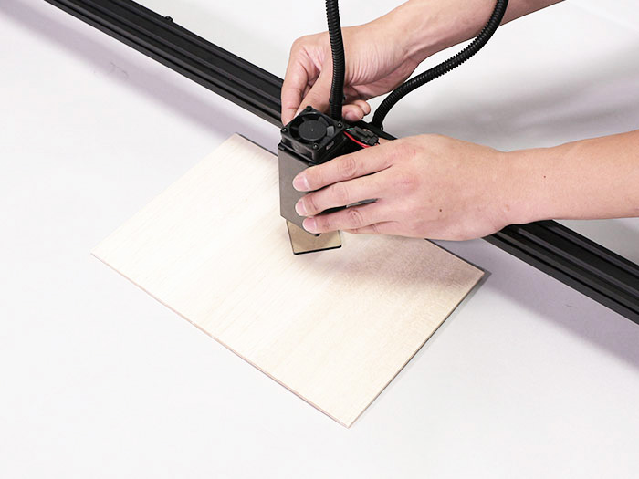
Loosen the screw of the optical carrier and lower it until the laser unit touches the height adjustment acrylic.

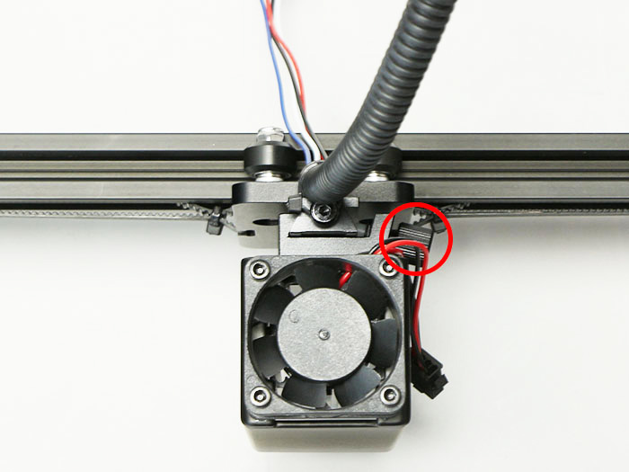

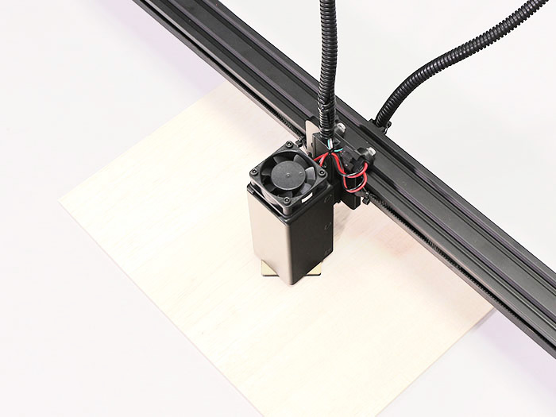
Tighten the screw of the optical carrier and remove the height adjustment acrylic.  
※ The unit may tilt forward slightly, but it will not affect processing.

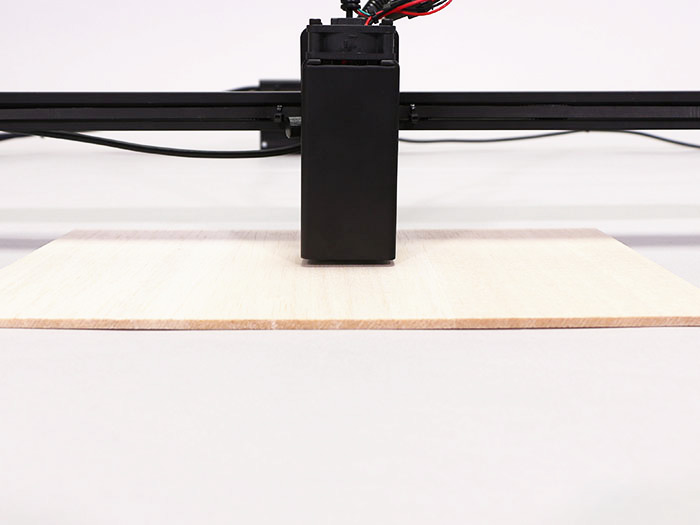

## Operation Check
In this process, the laser will not irradiate just by connecting the power supply. However, if it does, immediately disconnect the power supply, discontinue assembly, contact us.   
※ Wear the provided protective glasses and set material (wood board, etc.) to protect the surface under the laser unit, and connect power.

Connect AC cable to AC adapter.
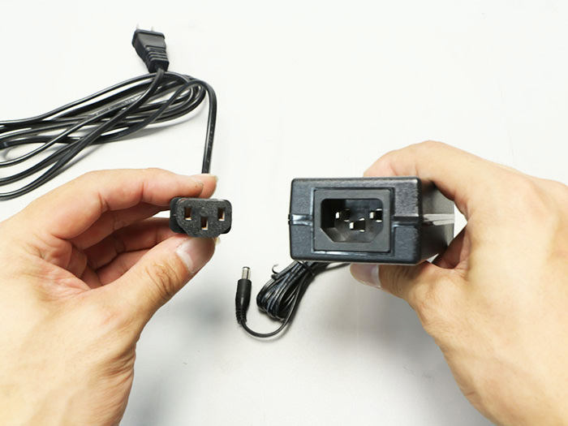

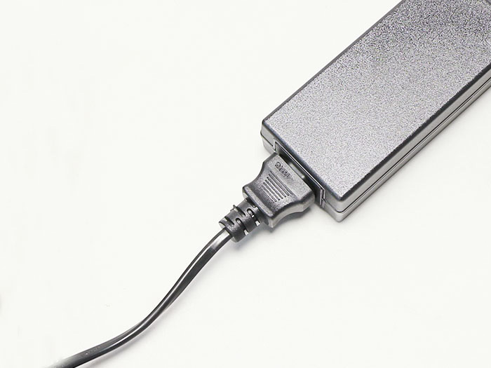
Connect AC adapter to PCB case.

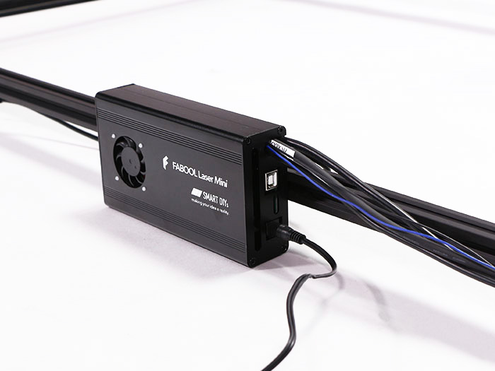
Connect USB cable to PCB case.

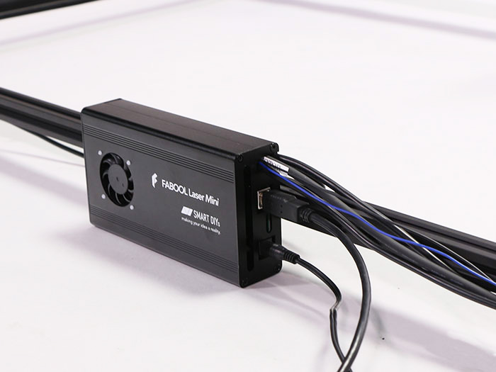
Connect USB cable to PC.

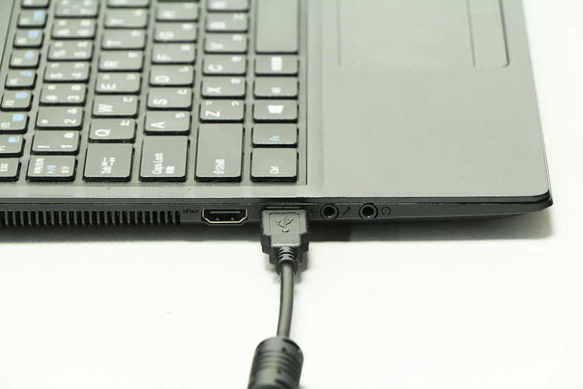
Connect the AC cable to a wall outlet (AC100V). Ensure that the PCB case DC fan is rotating.

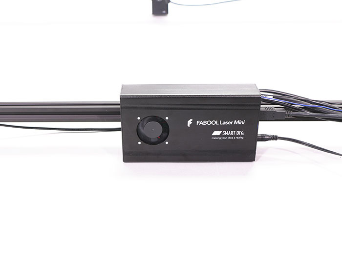
Ensure that the laser unit DC fan is rotating.

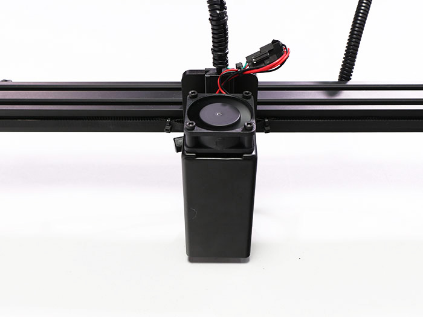

## Bottom Suurface Protection Material Placement
Be sure to install a board to protect the bottom surface. It is recommended to use non-combustible materials such as iron or stainless steel plates (dark colors less likely to reflect laser light) Be sure to use a size that can cover the processing range.
