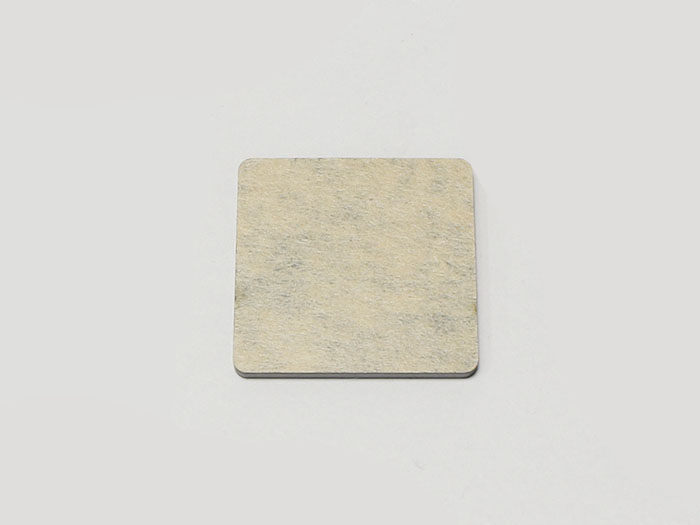
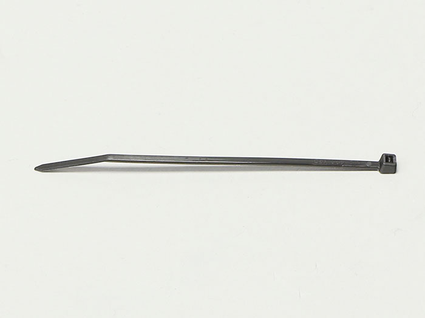

## Parts List
<table class="packing-list">
<tbody>
<tr>
<td>No</td>
<td>部品名</td>
<td>備考</td>
<td class="packing-img">画像</td>
<td>個数</td>
</tr>
<tr>
<td>20</td>
<td>Laser Unit</td>
<td></td>
<td></td>
<td>1</td>
</tr>
<tr>
<td>23</td>
<td>Optical Carrier</td>
<td></td>
<td></td>
<td>1</td>
</tr>
<tr>
<td></td>
<td>Height Adjustment Acrylic</td>
<td></td>
<td></td>
<td>1</td>
</tr>
<tr>
<td>48</td>
<td>M6×8 Hexagon Socket Cap Screw</td>
<td>Screw case</td>
<td></td>
<td>5</td>
</tr>
<tr>
<td>26</td>
<td>Cable tie</td>
<td></td>
<td></td>
<td>1</td>
</tr>
</tbody>
</table>

   
Use an acrylic for height adjustment, and attach the optical carrier to the laser unit with an M6x8 hex socket head cap screw.

Attach the optical carrier to the optical stage and connect the laser unit and the laser cable.

Secure cable with cable tie and cut off any excess material.

