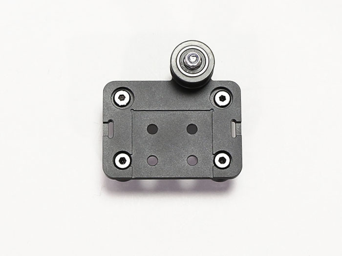

## Parts List
<table class="packing-list">
<tbody>
<tr>
<td>No</td>
<td>Parts Name</td>
<td>Notes</td>
<td class="packing-img">Pictures</td>
<td>Qty</td>
</tr>
<tr>
<td></td>
<td>mini v plate_L</td>
<td></td>
<td></td>
<td>1</td>
</tr>
<tr>
<td></td>
<td>mini v plate_R</td>
<td></td>
<td></td>
<td>1</td>
</tr>
<tr>
<td>11</td>
<td>mini v plate_L_2040_1m</td>
<td></td>
<td></td>
<td>1</td>
</tr>
<tr>
<td>12</td>
<td>mini v plate_R_2040_1m</td>
<td></td>
<td></td>
<td>1</td>
</tr>
<tr>
<td></td>
<td>mini v wheel unit</td>
<td></td>
<td></td>
<td>2</td>
</tr>
</tbody>
</table>

## mini v plate
Detach the wheel from mini v plate_R and mini v plate_L.

## FLM_mini v plate_L_2040_1m Assembly
Attach the eccentric spacer wheels to the red circle and the standard spacer wheels to the blue circle.  
The expansion frameset uses 4 wheels for the mini v plate.
For the other one, use the wheels with eccentric spacer attached to the expansion frame set.

Eccentric Spacer Wheel

Insert the eccentric spacer into the M5x25 low head bolt. Pay attention to the orientation of the eccentric spacer. Part of the eccentric spacer will be inserted into the mounting hole.

Affix the mini v wheel shim. There is no particular orientation.

Affix the wheel. There is no particular orientation.

Attach M5 nylon nut. Pay attention to the correct orientation of the M5 nylon nut.

Standard Spacer Wheel

Attach the wheel with a standard spacer. Insert a M5 x 25 low-head bolt into the mounting hole in the orientation shown in the picture.

Insert a standard spacer into the M5 x 25 low head bolt. There is no particular orientation for the spacer.

Affix the mini v wheel shim. There is no particular orientation.

Affix the wheel. There is no particular orientation.

Attach M5 nylon nut. Pay attention to the correct orientation of the M5 nylon nut.

Assemble all four.

## FLM_mini v plate_R_2040_1m Assembly
Attach the eccentric spacer wheel to the red circle and the standard spacer wheel to the blue circle.

Attach the 4 wheels in the same way as the previous FLM_mini v plate_L_2040_1m assembly.

## Idler Pulley Mounting
Mount the idler pulley where indicated in red.

Check the configuration of idler pulley. Be careful not to confuse the order and direction.

Insert a M5x25 low-head bolt into the mounting hole in the orientation shown in the picture.

Insert a 3.5mm spacer. There is no particular orientation.

Insert the idler. There is no particular orientation.

Attach M5 nylon nut. Pay attention to the correct orientation of the M5 nylon nut.

FLM_mini v plate_R_2040_1m assembly complete.

