## Parts List
<table class="packing-list">
<tbody>
<tr>
<td>No</td>
<td>Parts Name</td>
<td>Notes</td>
<td class="packing-img">Pictures</td>
<td>Qty</td>
</tr>
<tr>
<td>32</td>
<td>Stepping motor</td>
<td></td>
<td></td>
<td>3</td>
</tr>
<tr>
<td>27</td>
<td>motor mount plate x-axis</td>
<td></td>
<td></td>
<td>1</td>
</tr>
<tr>
<td>28</td>
<td>motor mount plate y-axis</td>
<td></td>
<td>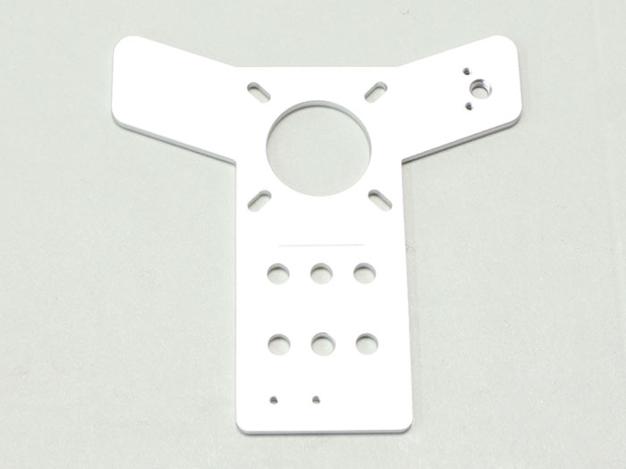</td>
<td>2</td>
</tr>
<tr>
<td>20</td>
<td>Timing pulley</td>
<td></td>
<td>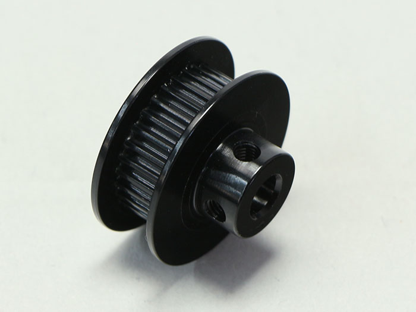</td>
<td>3</td>
</tr>
<tr>
<td>38</td>
<td>M3×6 Hexagon Socket Cap Screw</td>
<td>Screw case</td>
<td>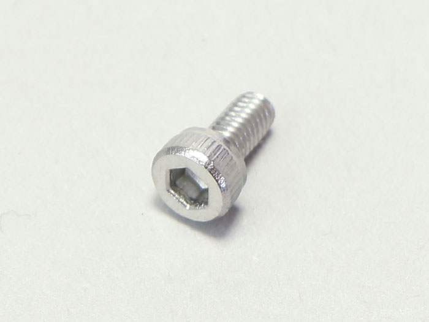</td>
<td>12</td>
</tr>
<tr>
<td>36</td>
<td>M3×3 Set Screw</td>
<td>Screw case</td>
<td></td>
<td>6</td>
</tr>
</tbody>
</table>

## X-Axis Motor Unit Assembly
### Motor Mount Plate X-Axis Mounting
Mount the motor mount plate X-axis to the stepping motor using four hex socket head cap bolts.  
※ Take note of the orientation of the mounted motor mount plate x-axis. Ensure that the two small holes are to the bottom right.

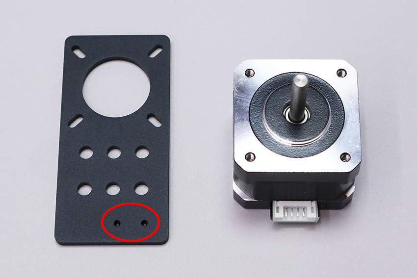

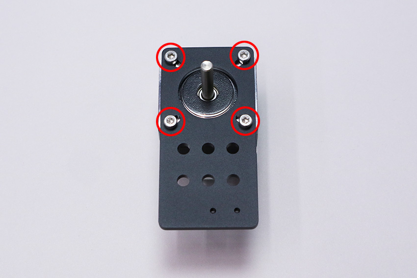

### Timing Pulley Mounting
Mount the timing pulley to the stepping motor using two M3 caterpillar screws. どちらか片方のネジ穴をステッピングモーターのシャフト切りかけ部分に合わせて取り付けて下さい。  
※ Secure temporarily as the height of the caterpillar screws used to mount the timing pulley will be adjusted later.
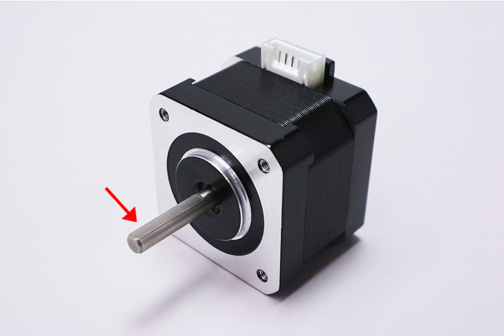

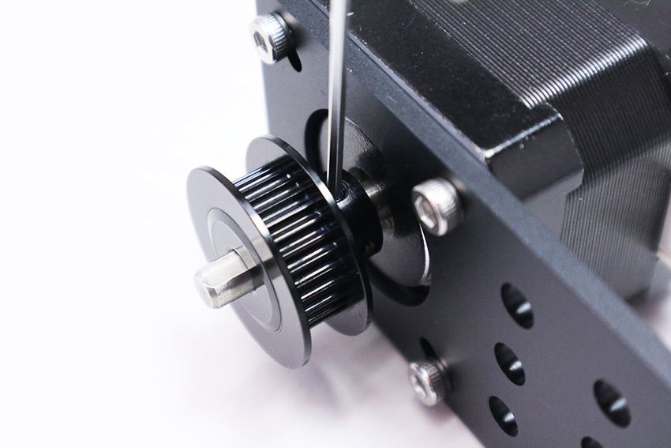

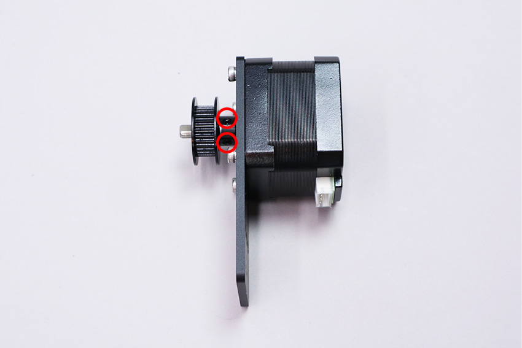

## Y-Axis Motor Unit Assembly
### Motor Mount Plate Y-Axis Mounting
Mount the motor mount plate Y-axis to the stepping motor using eight M3x6 hex socket head cap bolts.  
※ Ensure the correct orientation of the motor mount plate y-axis.
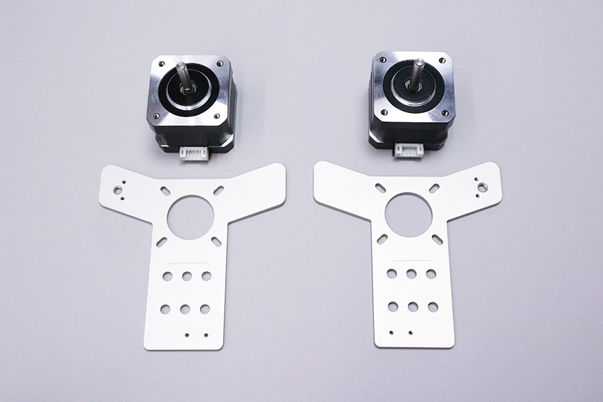

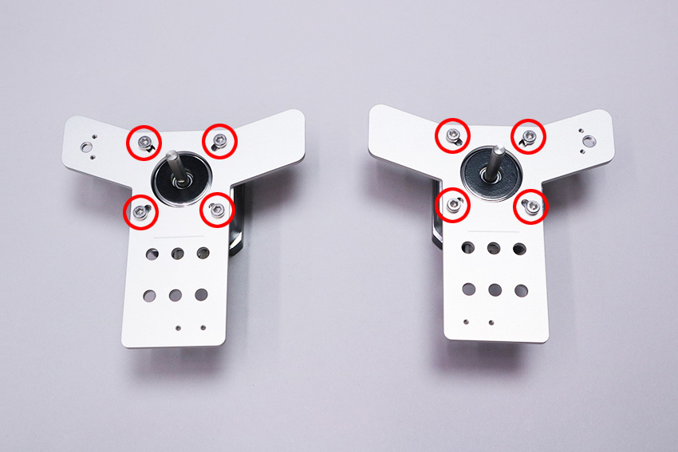

### Timing Pulley Mounting
Mount the timing pulley to the stepping motor using two M3 caterpillar screws. どちらか片方のネジ穴をステッピングモーターのシャフト切りかけ部分に合わせて取り付けてください。  
※ Secure temporarily for now as the height of the caterpillar screws used to mount the timing pulley will be adjusted later.
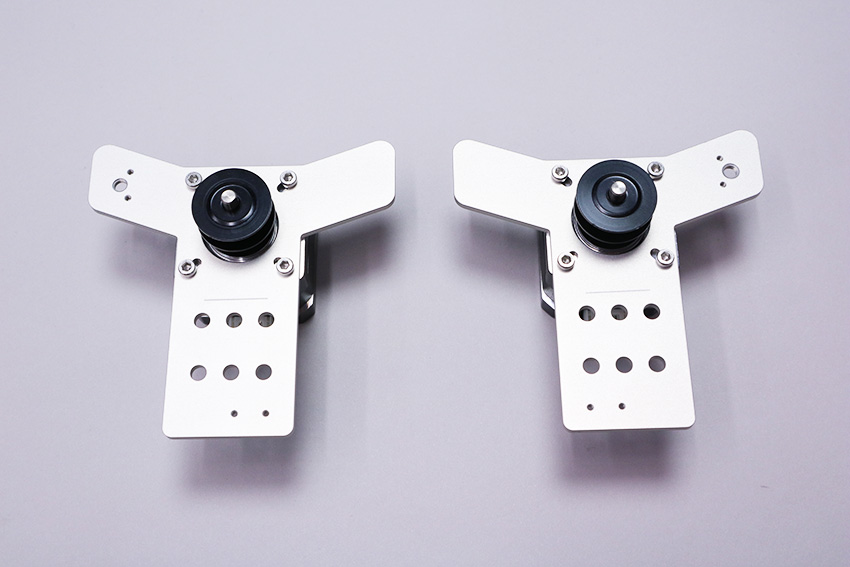
