## Parts List
Procedure differs for 1.6 W model and 3.5 W model. See relevant sections as they are explained below.

## PCB Case Assembly（1.6W）
### DC Fan Mounting
Mount the DC fan to the PCB case with four M3x10 nylon screws.  
※ Take note of the mounting orientation of the DC Fan.

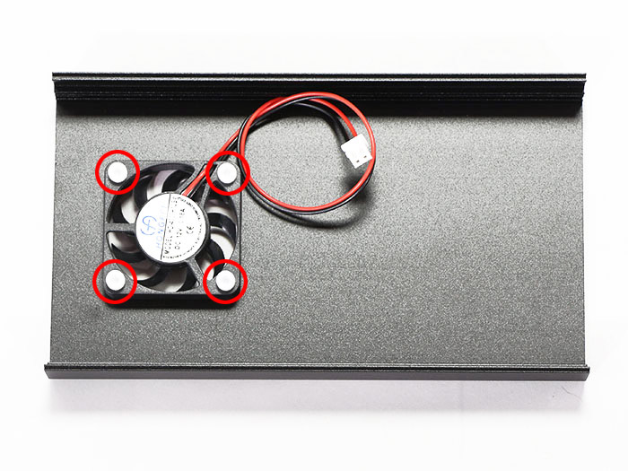
Connect the DC fan cable to the control board (FAN1).

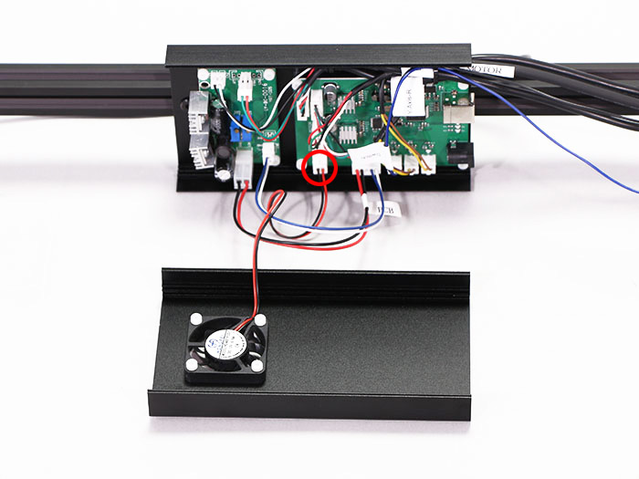
Secure the DC fan cable and the PCB cable with the cable ties.

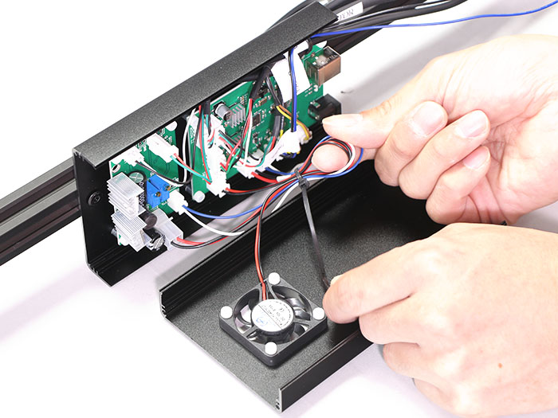
Cut off the excess material from the cable ties.

### Side Cover Attachment
Attach the side cover to the PCB case with four M3x6 hex socket flat countersunk bolts.  
※ Take note of the correct orientation of the side cover.

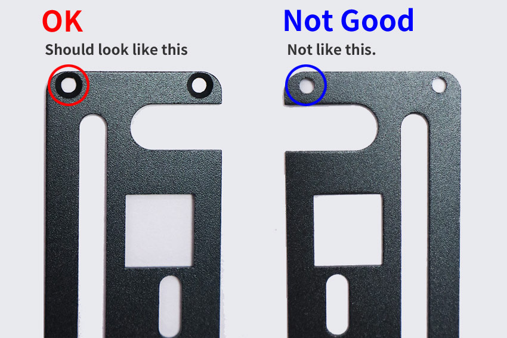

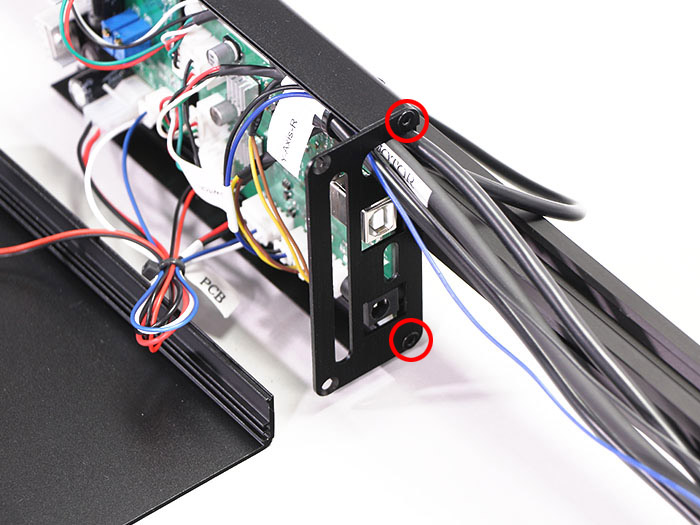

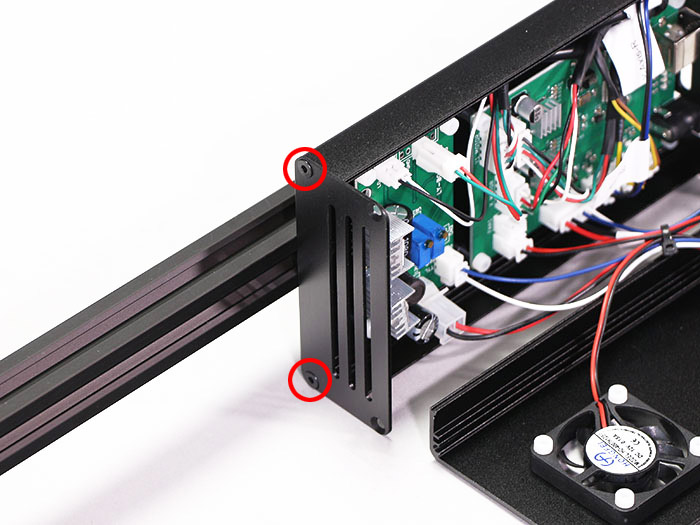

### Front Cover Attachment
フロントカバーをM3&times;6六角穴付皿ボルト4個で取り付けます。  
※カバーが閉じない場合はヒートシンクを5ｍｍ程傾けてください。
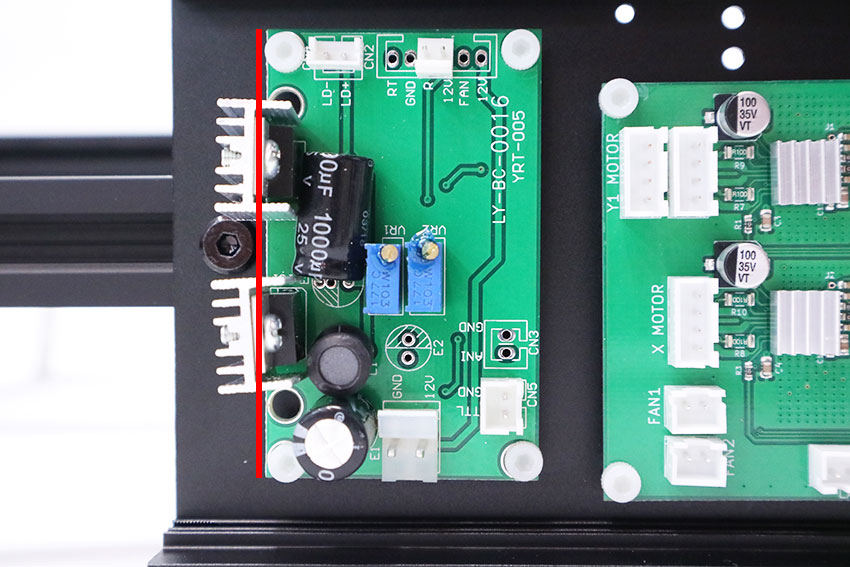

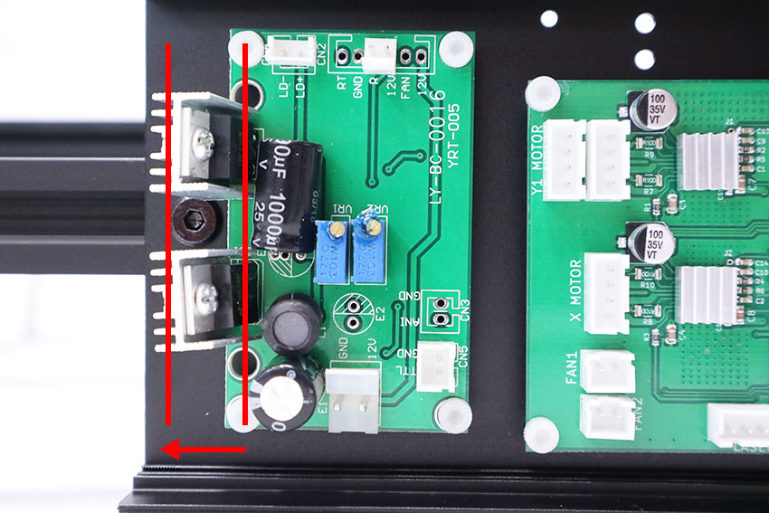

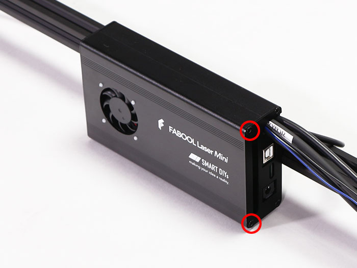

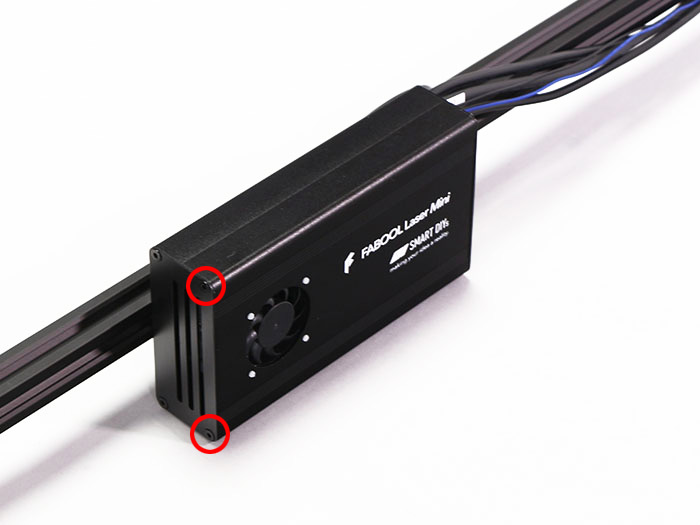

## PCBケースの組み立て（3.5W）
### DCファンの取り付け
PCBケースにDCファンをM3&times;10ナイロンネジ4個で取り付けます。  
※DCファンには取り付ける向きがあるので注意して下さい。

DCファンケーブルをコントロール基板（FAN1）に接続します。
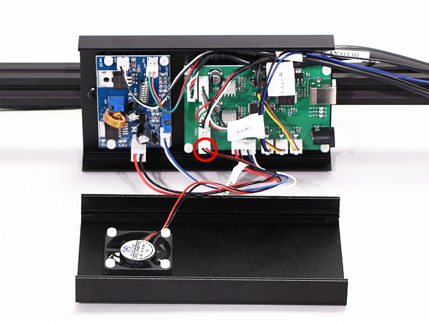

DCファンケーブルとPCBケーブルを結束バンドで固定します。

結束バンドの不要な部分を切り取ります。

### サイドカバーの取り付け
PCBケースにサイドカバーをM3&times;6六角穴付皿ボルト4個で取り付けます。  
※サイドカバーには取り付ける向きがあるので注意して下さい。

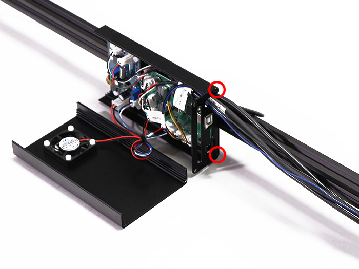

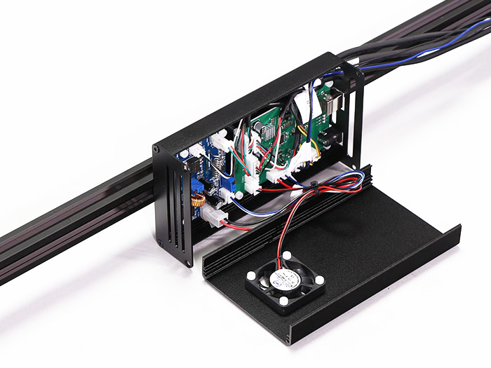

### フロントカバーの取り付け
フロントカバーをM3&times;6六角穴付皿ボルト4個で取り付けます。

