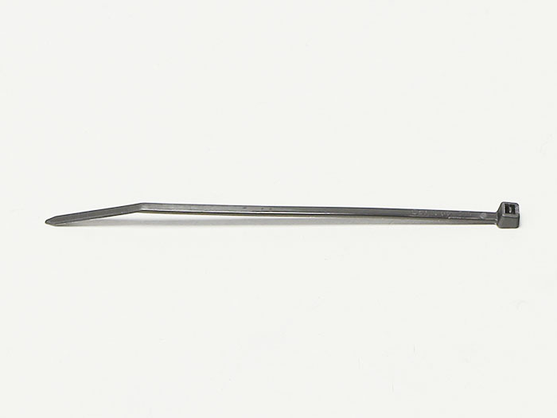
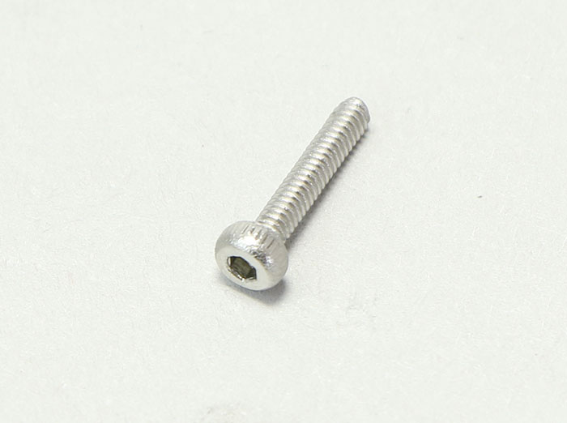

## Parts List
<table class="packing-list">
<tbody>
<tr>
<td>No</td>
<td>Parts Name</td>
<td>Notes</td>
<td class="packing-img">Pictures</td>
<td>Qty</td>
</tr>
<tr>
<td>19</td>
<td>Corrugated tube</td>
<td></td>
<td></td>
<td>1</td>
</tr>
<tr>
<td>42</td>
<td>M3 T Nut</td>
<td>Screw case</td>
<td></td>
<td>3</td>
</tr>
<tr>
<td>39</td>
<td>M3×6 Hexagon Socket Cap Screw</td>
<td>Screw case</td>
<td></td>
<td>22</td>
</tr>
<tr>
<td>25</td>
<td>Cable catch</td>
<td></td>
<td></td>
<td>1</td>
</tr>
<tr>
<td>26</td>
<td>Cable tie</td>
<td></td>
<td></td>
<td>1</td>
</tr>
<tr>
<td>36</td>
<td>M2x10 Hexagon Socket Cap Screw</td>
<td>Screw case</td>
<td></td>
<td>8</td>
</tr>
</tbody>
</table>

## Cable Tie Clamp Installation
The photo is viewed from the back of the machine.  
Attach the cable tie clamps where indicated by red circles and arrows.  
※ The arrow indicates the bottom of the frame with the PCB attached.

Stand the main unit up, insert two M3 post-insertion nuts into the groove of the frame where indicated by the red circle, and attach two cable tie clamps using two M3x6 hex socket head cap screws.

Next install a cable tie clamp where indicated in red.

## Main Body Right Side Wiring
Wire the Y-Axis-R cable.  
Referencing the picture below, secure the Y-Axis-R cable using a cable tie clamp.

Connect the Y-Axis-R cable to the stepping motor.

## Main Body Left Side Wiring
Referencing the picture, secure the following with a cable tie clamp.  
・Laser Cable  
・X-Axis Cable  
・Y-Axis-L Cable  
・Foot Switch Cable

Install the foot switch cable using two M2x10 hex socket head cap bolts.

Return the machine to its original position.

Connect the Y-Axis-L cable to the stepping motor.

Taking note of the correct orientation of the limit switch of the Y-Axis-L cable, attach it with two M2x10 hex socket head cap bolts.

Taking note of the correct orientation of the limit switch of the X-Axis cable, attach it with two M2x10 hex socket head cap bolts.

Connect the X-Axis cable to the stepping motor

Referencing the picture, secure the Laser and X-Axis cables where indicated in red using a cable tie and cable tie clamp.  
When tightening the cable ties, refer to the picture and adjust the cable length with the X-Axis as far as possible from the PCB.

Slide the laser cable into the corrugated tube.  
Push the laser cable through the cut in the corrugated tube.

Refer to the picture and secure the laser cable cable tie to the cable tie clamp.

Fasten the corrugated tube end of the laser cable to the cable tie clamp attached at the center of the X-Axis with cable ties.

Attach the other side of the corrugated tube to the M4x40 hex socket head cap bolt on top of the mini v plate_C with two cable ties.

Cut off excess material from cable ties.
