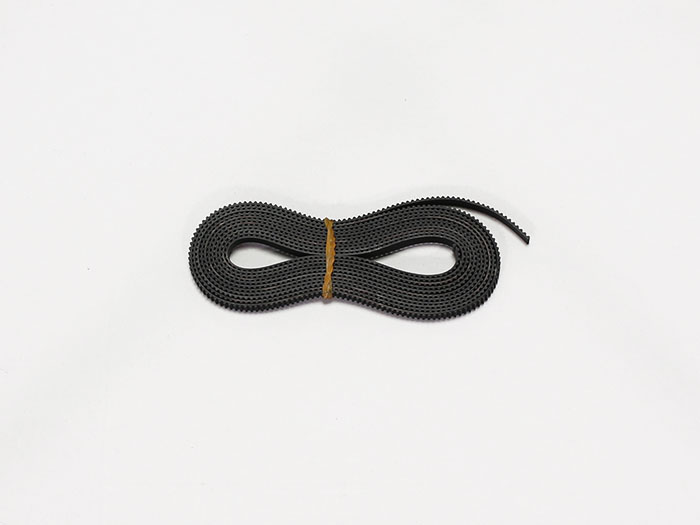

## Parts List
<table class="packing-list">
<tbody>
<tr>
<td>No</td>
<td>Parts Name</td>
<td>Notes</td>
<td class="packing-img">Pictures</td>
<td>Qty</td>
</tr>
<tr>
<td>10</td>
<td>mini v plate_C</td>
<td></td>
<td></td>
<td>1</td>
</tr>
<tr>
<td>11</td>
<td>mini v plate_L_2040_1m</td>
<td></td>
<td></td>
<td>1</td>
</tr>
<tr>
<td>12</td>
<td>mini v plate_R_2040_1m</td>
<td></td>
<td></td>
<td>1</td>
</tr>
<tr>
<td></td>
<td>2040 v-slot 1210mm</td>
<td></td>
<td></td>
<td>1</td>
</tr>
<tr>
<td></td>
<td>X-axis motor unit</td>
<td></td>
<td></td>
<td>1</td>
</tr>
<tr>
<td></td>
<td>Timing belt 2700mm</td>
<td></td>
<td></td>
<td>1</td>
</tr>
<tr>
<td>26</td>
<td>Cable tie</td>
<td></td>
<td></td>
<td>1</td>
</tr>
<tr>
<td>46</td>
<td>M5×8 Low Head Screw</td>
<td>Screw case</td>
<td></td>
<td>25</td>
</tr>
<tr>
<td>47</td>
<td>M5 T Nut</td>
<td>Screw case</td>
<td></td>
<td>28</td>
</tr>
<tr>
<td>44</td>
<td>M4x40 hexagon socket Cap Screw</td>
<td>Screw case</td>
<td></td>
<td>1</td>
</tr>
<tr>
<td>22</td>
<td>Optical Stage</td>
<td></td>
<td></td>
<td>1</td>
</tr>
<tr>
<td>48</td>
<td>M6×8 hexagon socket Cap Screw</td>
<td>Screw case</td>
<td></td>
<td>5</td>
</tr>
</tbody>
</table>

## Mini V Plate Adjustment and Mini V Plate_C Attachment
## X-Axis Assembly
Adjust mini v plate_L, mini v plate_R, and mini v plate_C.

[Eccentric Spacer Video]

<iframe width="560" height="315" src="https://www.youtube.com/embed/y8QG-4ASV9U" frameborder="0" allow="accelerometer; autoplay; encrypted-media; gyroscope; picture-in-picture" allowfullscreen></iframe>

 

### mini v plate_R_2040_1m Installation
Slide mini v plate_C into 2040 V-slot 1210mm.

Flip V-slot 1210mm over and insert four M5T nuts as shown in picture.

Install mini v plate_R_2040_1m using four M5x8 low head bolts. Align the tip of 2040 V-slot 1210mm to the groove of mini v plate_R_2040_1m.

### Mini V Plate_L Installation
Insert four M5T nuts where indicated in the picture.

Install mini v plate_L_2040_1m using four M5x8 low head bolts. Align the tip of 2040 V-slot 1210mm to the groove of mini v plate_L.

## X-Axis Motor Unit Mount
Insert two M5T nuts into the 2040 V-slot 1210mm where indicated in the picture.

Mount the X-Axis motor unit using two M5x8 hex socket head cap bolts.  
※ Mount tentatively as it will be adjusted at a later stage.

## Timing Belt Mounting
Mount the timing belt so that the grooves of the uneven surface align with the timing pulley teeth.  
※ Ensure timing belt is not twisted.

Attach timing belt where indicated A-D as shown in picture.

A, Insert timing 3600mm belt into mini v plate_C with the jagged side up and secure it with a cable tie. See video for how to secure.

[Timing Belt Fastening Video]

<iframe width="560" height="315" src="https://www.youtube.com/embed/EJ0unA_HlrA" frameborder="0" allow="accelerometer; autoplay; encrypted-media; gyroscope; picture-in-picture" allowfullscreen></iframe>

 

<iframe width="560" height="315" src="https://www.youtube.com/embed/Gq2b4nlQAnA" frameborder="0" allow="accelerometer; autoplay; encrypted-media; gyroscope; picture-in-picture" allowfullscreen></iframe>

Insert timing belt into B and C.

D, Insert timing 3600mm belt into right side of mini v plate_C with the jagged side up and secure it with a cable tie.

If there is extra material remaining of the timing belt, cut it off leaving about 30mm. Cut off excess from the cable ties. There may be risk of injury if there is any excess material remaining so cut as close to the base as possible.

Adjust the positioning of the X-Axis motor unit. Ensure that it is aligned with the groove of 2040 V-slot 1210mm.

If it is significantly out of alignment, loosen the caterpillar screws, adjust, and refasten.

Tighten the timing belt. Loosen the X-Axis motor unit M5x8 bolts and refasten, pulling it in the direction of the arrow. Ensure that stepping motor and 2040 V-slot 1210mm are aligned evenly. See video below for proper timing belt tension.

 

[Video　Timing Belt Tension]

<iframe width="560" height="315" src="https://www.youtube.com/embed/B0T3zE79iKU" frameborder="0" allow="accelerometer; autoplay; encrypted-media; gyroscope; picture-in-picture" allowfullscreen></iframe>

## Optic Stage Mounting
Mount optic stage to mini v plate_C using two M6x8 hex socket head cap bolts.

Insert M4x8 low head bolt to top of optic stage.

