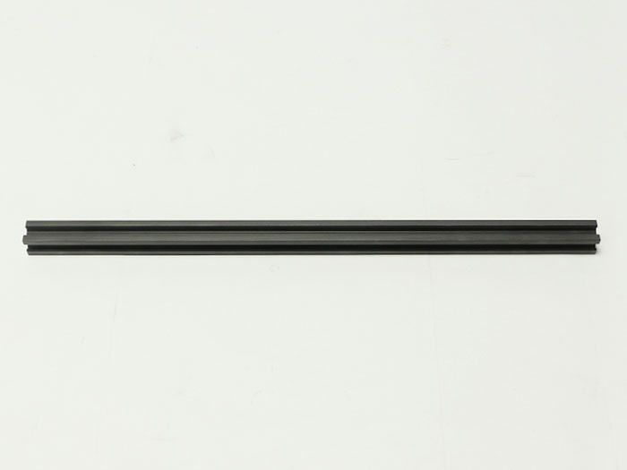
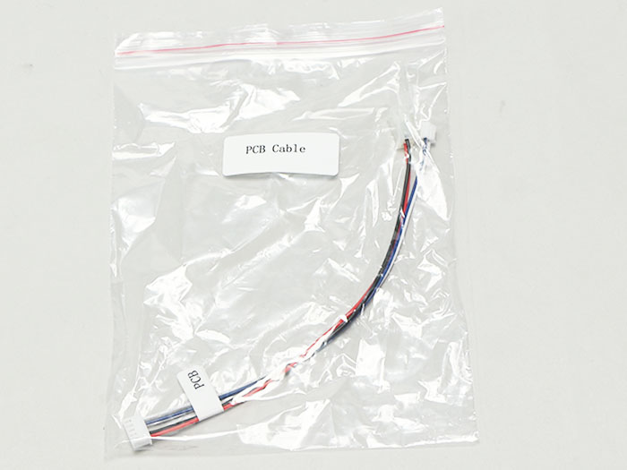
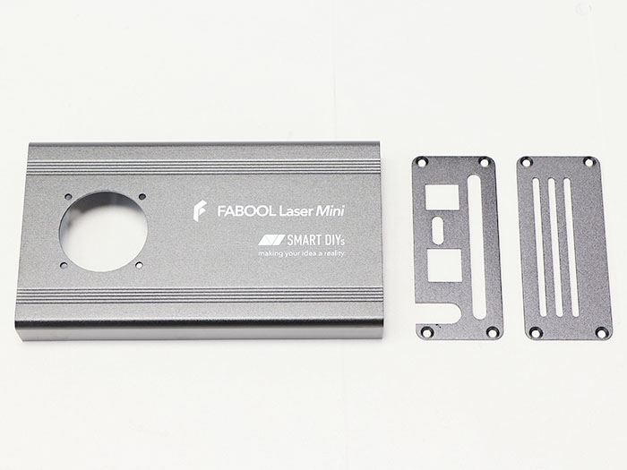
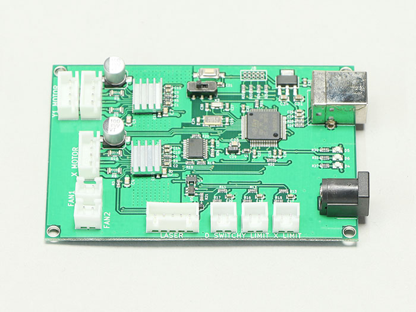
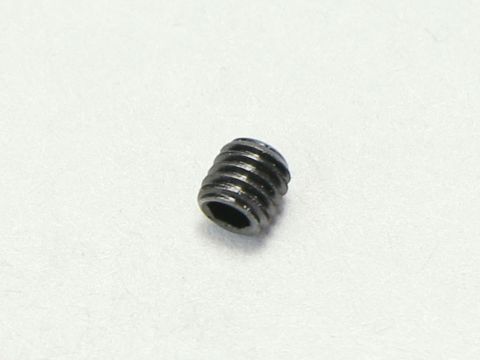
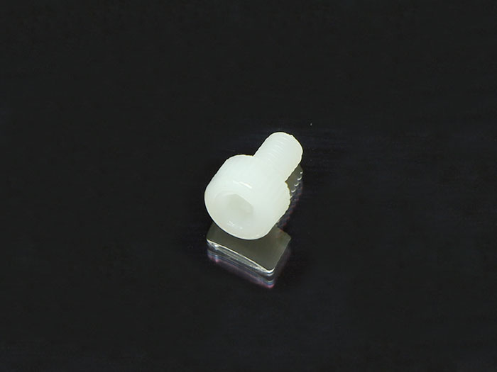
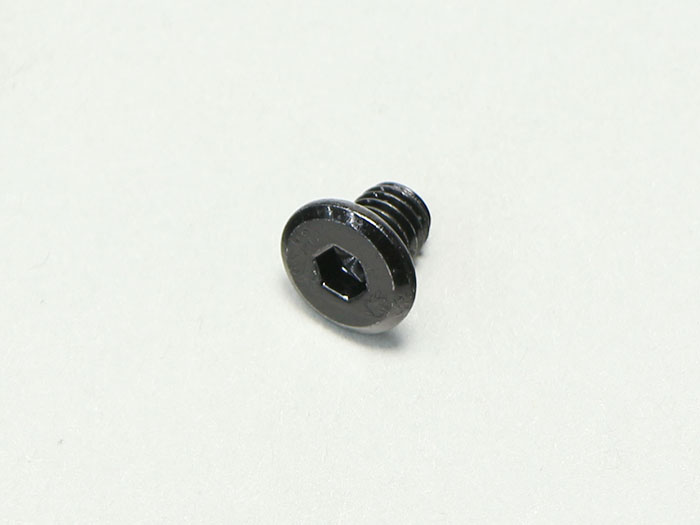

## Parts List
<table class="packing-list">
<tbody>
<tr>
<td>No</td>
<td>Parts Name</td>
<td>Notes</td>
<td class="packing-img">Pictures</td>
<td>Qty</td>
</tr>
<tr>
<td>1</td>
<td>V-slot 450mm</td>
<td>300x230mmで使用</td>
<td></td>
<td>1</td>
</tr>
<tr>
<td>2</td>
<td>V-slot 410mm</td>
<td>300x230mmで使用</td>
<td></td>
<td>4</td>
</tr>
<tr>
<td>3</td>
<td>V-slot 760mm</td>
<td>600x420mmで使用</td>
<td></td>
<td>1</td>
</tr>
<tr>
<td>4</td>
<td>V-slot 720mm</td>
<td>600x420mmで使用</td>
<td></td>
<td>2</td>
</tr>
<tr>
<td>5</td>
<td>V-slot 610mm</td>
<td>600x420mmで使用</td>
<td></td>
<td>2</td>
</tr>
<tr>
<td>6</td>
<td>Bracket</td>
<td>300x230mmで使用</td>
<td></td>
<td>4</td>
</tr>
<tr>
<td>7</td>
<td>Right angle Bracket</td>
<td>600x420mmで使用</td>
<td></td>
<td>4</td>
</tr>
<tr>
<td>8</td>
<td>Timing belt 1500mm</td>
<td>300x230mmで使用</td>
<td></td>
<td>3</td>
</tr>
<tr>
<td>9</td>
<td>Timing belt 1700cm</td>
<td>600x420mmで使用</td>
<td></td>
<td>3</td>
</tr>
<tr>
<td>10</td>
<td>mini v plate_C</td>
<td></td>
<td></td>
<td>1</td>
</tr>
<tr>
<td>11</td>
<td>mini v plate_L</td>
<td></td>
<td></td>
<td>1</td>
</tr>
<tr>
<td>12</td>
<td>mini v plate_R</td>
<td></td>
<td></td>
<td>1</td>
</tr>
<tr>
<td>13</td>
<td>PCB cable</td>
<td></td>
<td></td>
<td>1</td>
</tr>
<tr>
<td>14</td>
<td>Laser cable</td>
<td></td>
<td></td>
<td>1</td>
</tr>
<tr>
<td>15</td>
<td>X-Axis cable</td>
<td></td>
<td></td>
<td>1</td>
</tr>
<tr>
<td>16</td>
<td>Y-Axis-R cable</td>
<td></td>
<td></td>
<td>1</td>
</tr>
<tr>
<td>17</td>
<td>Y-Axis-L cable</td>
<td></td>
<td></td>
<td>1</td>
</tr>
<tr>
<td>18</td>
<td>Foot Switch cable</td>
<td></td>
<td></td>
<td>1</td>
</tr>
<tr>
<td>19</td>
<td>Laser unit</td>
<td></td>
<td></td>
<td>1</td>
</tr>
<tr>
<td>20</td>
<td>Timing pulley</td>
<td></td>
<td></td>
<td>3</td>
</tr>
<tr>
<td>21</td>
<td>Optical stage</td>
<td></td>
<td></td>
<td>1</td>
</tr>
<tr>
<td>22</td>
<td>Optical carrier</td>
<td></td>
<td></td>
<td>1</td>
</tr>
<tr>
<td>23</td>
<td>PCB case</td>
<td></td>
<td></td>
<td>1</td>
</tr>
<tr>
<td>24</td>
<td>Cable catch</td>
<td></td>
<td></td>
<td>1</td>
</tr>
<tr>
<td>25</td>
<td>Cable tie</td>
<td></td>
<td></td>
<td>1</td>
</tr>
<tr>
<td>26</td>
<td>idler pulley plate</td>
<td></td>
<td></td>
<td>2</td>
</tr>
<tr>
<td>27</td>
<td>motor mount plate x-axis</td>
<td></td>
<td></td>
<td>1</td>
</tr>
<tr>
<td>28</td>
<td>motor mount plate y-axis</td>
<td></td>
<td></td>
<td>2</td>
</tr>
<tr>
<td>29</td>
<td>AC adaptor</td>
<td></td>
<td></td>
<td>1</td>
</tr>
<tr>
<td>30</td>
<td>AC cable</td>
<td></td>
<td></td>
<td>1</td>
</tr>
<tr>
<td>31</td>
<td>USB cable</td>
<td></td>
<td></td>
<td>1</td>
</tr>
<tr>
<td>32</td>
<td>Stepping motor</td>
<td></td>
<td></td>
<td>3</td>
</tr>
<tr>
<td>33</td>
<td>Control board</td>
<td></td>
<td></td>
<td>1</td>
</tr>
<tr>
<td>34</td>
<td>DC fan</td>
<td></td>
<td></td>
<td>1</td>
</tr>
<tr>
<td>35</td>
<td>M2×10 Hexagon Socket Cap Screw</td>
<td rowspan="13">Screw case</td>
<td></td>
<td>8</td>
</tr>
<tr>
<td>36</td>
<td>M3×3 Set Screws</td>
<td></td>
<td>10</td>
</tr>
<tr>
<td>37</td>
<td>M3×5 Nylon Screw</td>
<td></td>
<td>11</td>
</tr>
<tr>
<td>38</td>
<td>M3×6 Hexagon Socket Cap Screw</td>
<td></td>
<td>22</td>
</tr>
<tr>
<td>39</td>
<td>M3×6 Hexagon Socket Countersunk Head Screw</td>
<td></td>
<td>10</td>
</tr>
<tr>
<td>40</td>
<td>M3×10 Hexagon Socket Cap Screw</td>
<td></td>
<td>6</td>
</tr>
<tr>
<td>41</td>
<td>M3 T Nut</td>
<td></td>
<td>3</td>
</tr>
<tr>
<td>42</td>
<td>M4×8 Low Head Screw</td>
<td></td>
<td>10</td>
</tr>
<tr>
<td>43</td>
<td>M4x40 Hexagon Socket Cap Screw</td>
<td></td>
<td>1</td>
</tr>
<tr>
<td>44</td>
<td>M5×6 Low Head Screw</td>
<td></td>
<td>4</td>
</tr>
<tr>
<td>45</td>
<td>M5×8 Low Head Screw</td>
<td></td>
<td>25</td>
</tr>
<tr>
<td>46</td>
<td>M5 T Nut</td>
<td></td>
<td>28</td>
</tr>
<tr>
<td>47</td>
<td>M6×8  Hexagon Socket Cap Screw</td>
<td></td>
<td>5</td>
</tr>
</tbody>
</table>
