## Parts List
<table class="packing-list">
<tbody>
<tr>
<td>No</td>
<td>Parts Name</td>
<td>Notes</td>
<td class="packing-img">Pictures</td>
<td>Qty</td>
</tr>
<tr>
<td>23</td>
<td>PCB Case</td>
<td></td>
<td>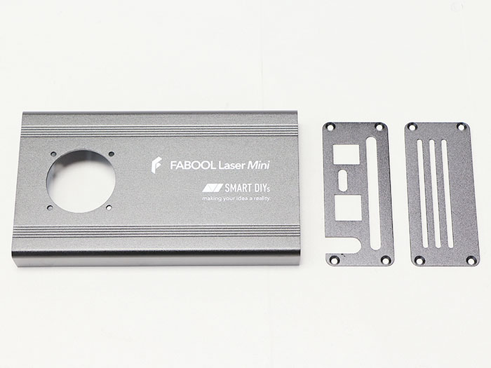</td>
<td>1</td>
</tr>
<tr>
<td>34</td>
<td>DC fan</td>
<td></td>
<td></td>
<td>1</td>
</tr>
<tr>
<td>39</td>
<td>M3×6 Hexagon Socket Countersunk Head Screw</td>
<td>Screw case</td>
<td>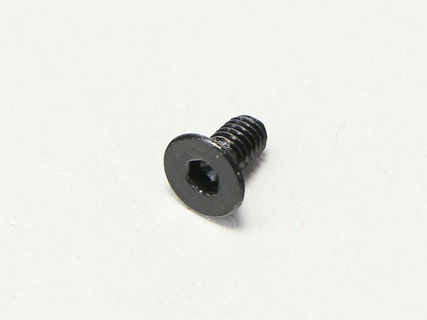</td>
<td>10</td>
</tr>
<tr>
<td></td>
<td>M3×10 Nylon Screw</td>
<td></td>
<td>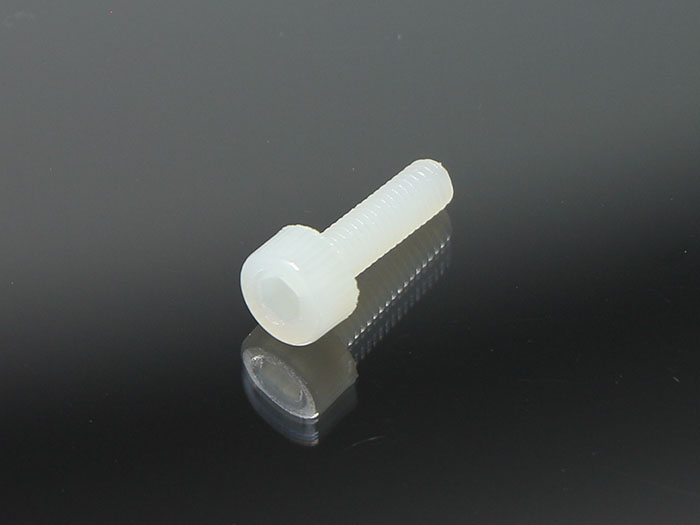</td>
<td>3</td>
</tr>
</tbody>
</table>

 

Procedure differs for 1.6 W model and 3.5 W model. See relevant sections as they are explained below.

## PCB Case Assembly（1.6W）
### DC Fan Mounting
Mount the DC fan to the PCB case with four M3x10 nylon screws.  
※Take note of the mounting orientation of the DC Fan.
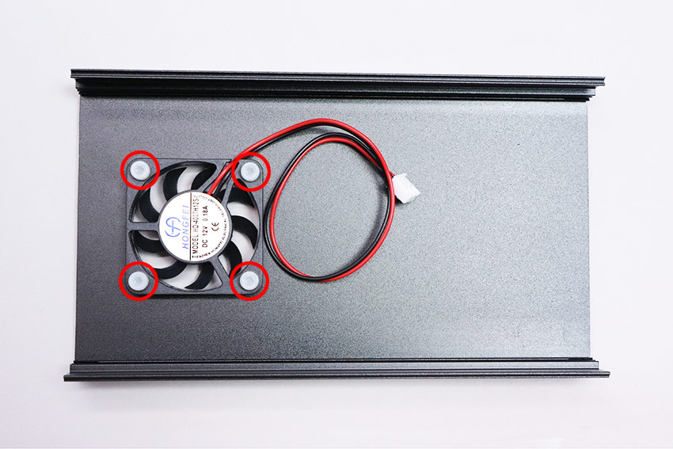

Connect the DC fan cable to the control board (FAN1).

Secure the DC fan cable and the PCB cable with the cable ties.
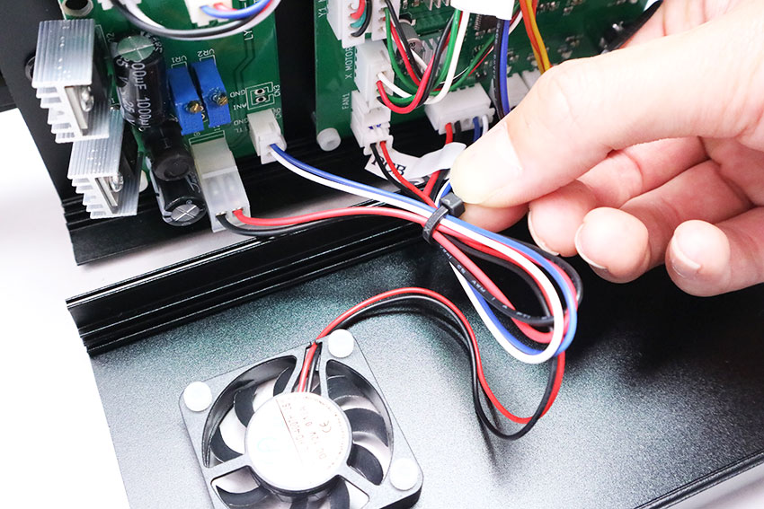

Cut off the excess material from the cable ties.

### Side Cover Attachment
Attach the side cover to the PCB case with four M3x6 hex socket flat countersunk bolts.  
*Take note of the correct orientation of the side cover.
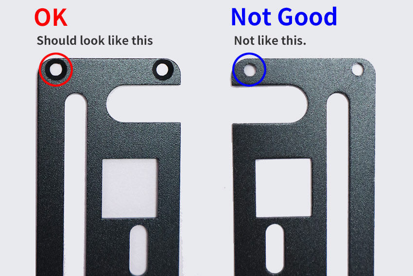

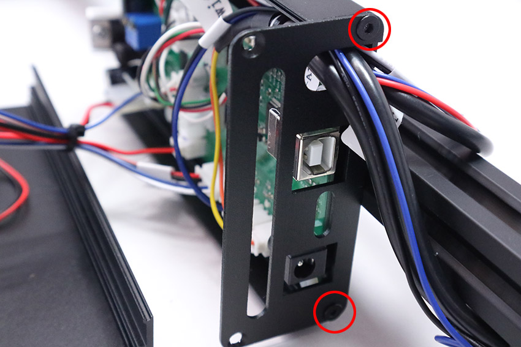

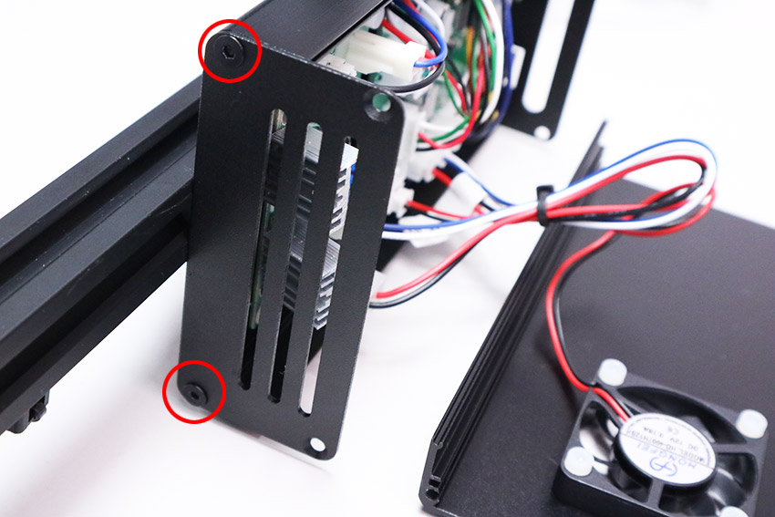

### Front Cover Attachment
Attach the front cover with four M3x6 hex socket flat head countersunk bolts.  
*If the cover does not close, tilt the heat sink about 5 mm.

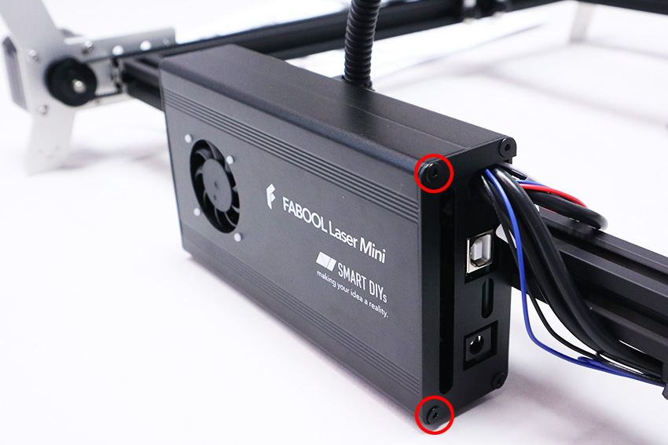

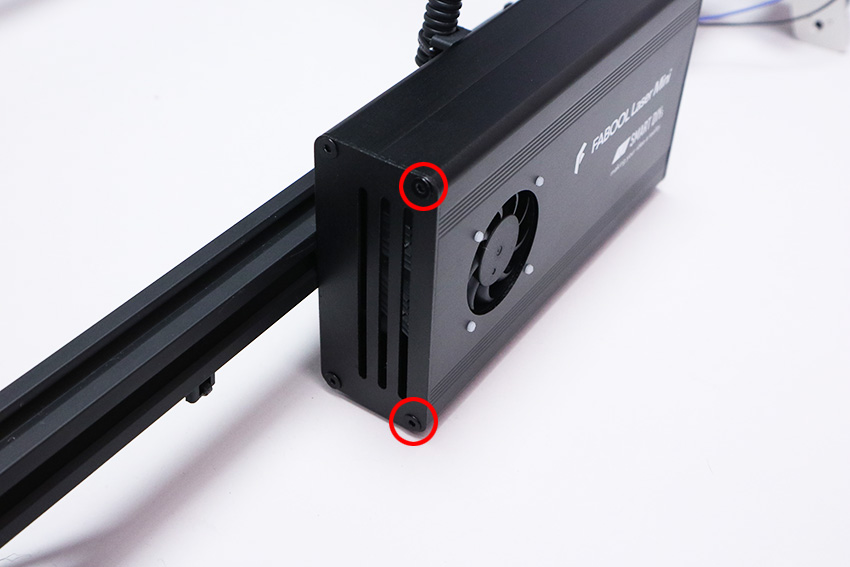

## PCB Case Assembly（3.5W）
### DC Fan Mounting
Mount the DC fan to the PCB case with four M3x10 nylon screws.  
※Take note of the mounting orientation of the DC Fan.

Connect the DC fan cable to the control board (FAN1).

Secure the DC fan cable and the PCB cable with the cable ties.
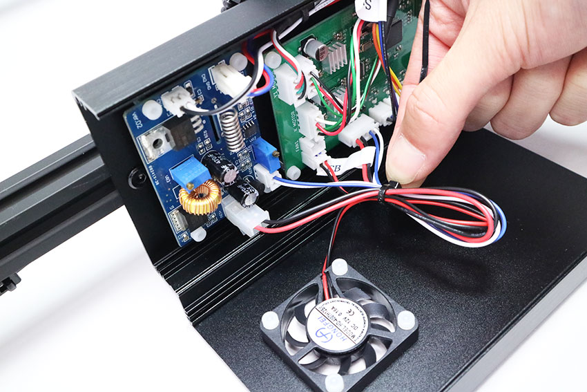

Cut off the excess material from the cable ties.
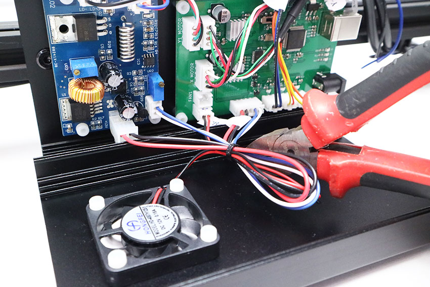

### Side Cover Attachment
Attach the side cover to the PCB case with four M3x6 hex socket flat countersunk bolts.  
*Take note of the correct orientation of the side cover.

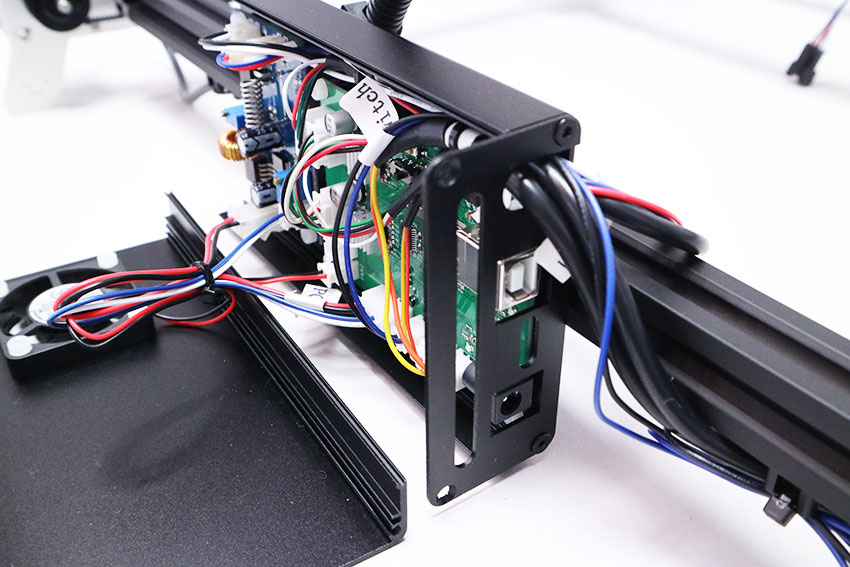

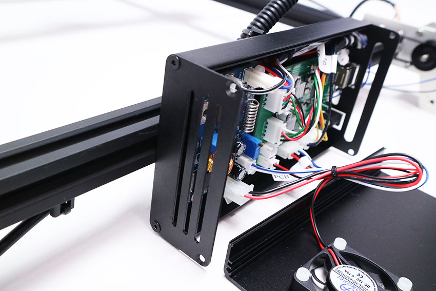

### Front Cover Attachment
Attach the front cover with four M3x6 hex socket flat head countersunk bolts.

