## Parts List
<table class="packing-list">
<tbody>
<tr>
<td>No</td>
<td>Parts Name</td>
<td>Notes</td>
<td class="packing-img">Pictures</td>
<td>Qty</td>
</tr>
<tr>
<td>23</td>
<td>PCB case</td>
<td></td>
<td>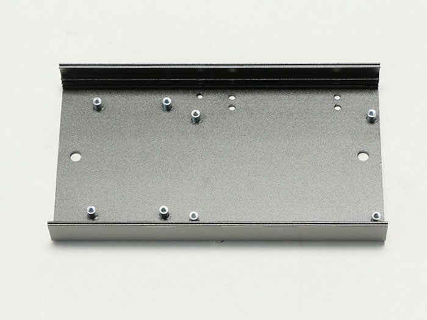</td>
<td>1</td>
</tr>
<tr>
<td></td>
<td>Laser Board (1.6W/3.5W)</td>
<td></td>
<td>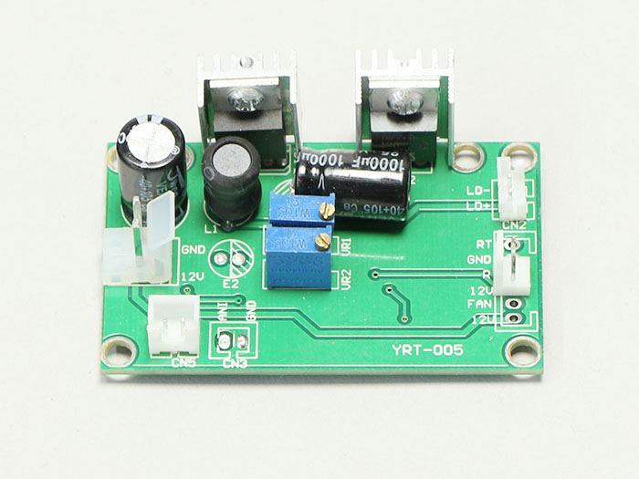</td>
<td>1</td>
</tr>
<tr>
<td>33</td>
<td>Control Board</td>
<td></td>
<td></td>
<td>1</td>
</tr>
<tr>
<td>44</td>
<td>M5×6 Low Head Screw</td>
<td>Screw case</td>
<td></td>
<td>4</td>
</tr>
<tr>
<td>37</td>
<td>M3×5 Nylon Screw</td>
<td>Screw case</td>
<td></td>
<td>11</td>
</tr>
<tr>
<td>24</td>
<td>Cable catch</td>
<td></td>
<td></td>
<td>1</td>
</tr>
</tbody>
</table>

 

Procedure differs for 1.6 W model and 3.5 W model. See relevant sections as they are explained below.

## Circuit Board Installation（1.6W）
Install the PCB case with two M5x6 low head bolts using the M5T nut pre-inserted for Y-axis assembly.
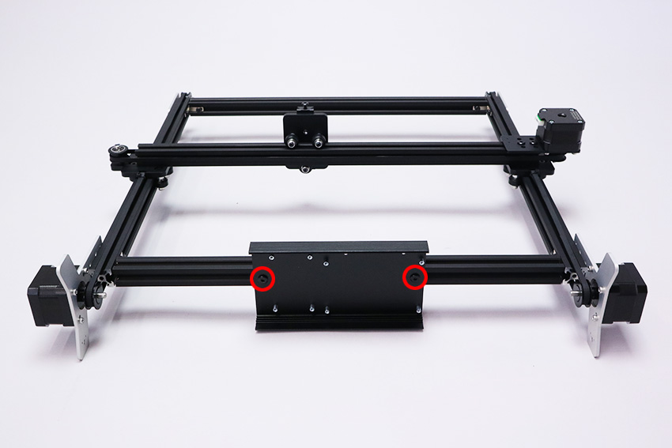

Install the laser circuit board to the PCB case using four M3x5 nylon screws.
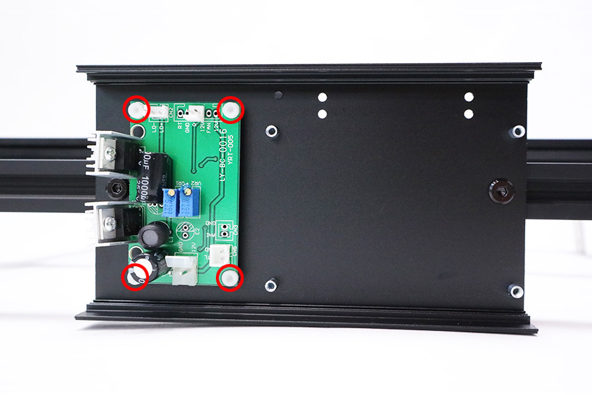

Install the control board to the PCB case using four M3x5 nylon screws.
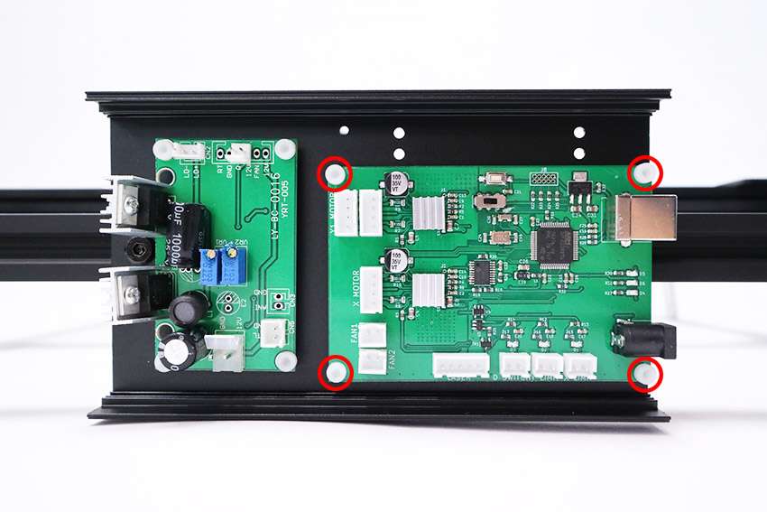

Ensure that the control board switch is on the left side.
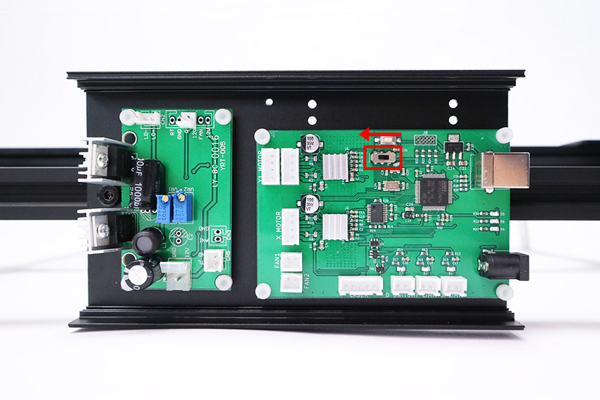

Fasten the cable tie clamp to the back of the PCB case using a M3x5 nylon screw.
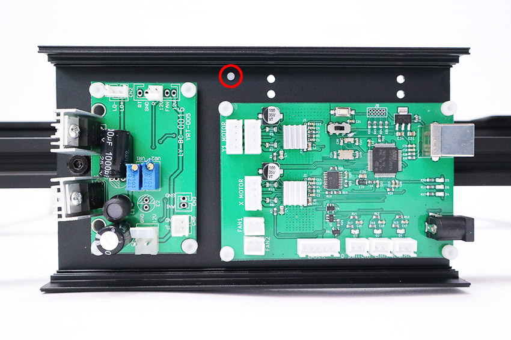

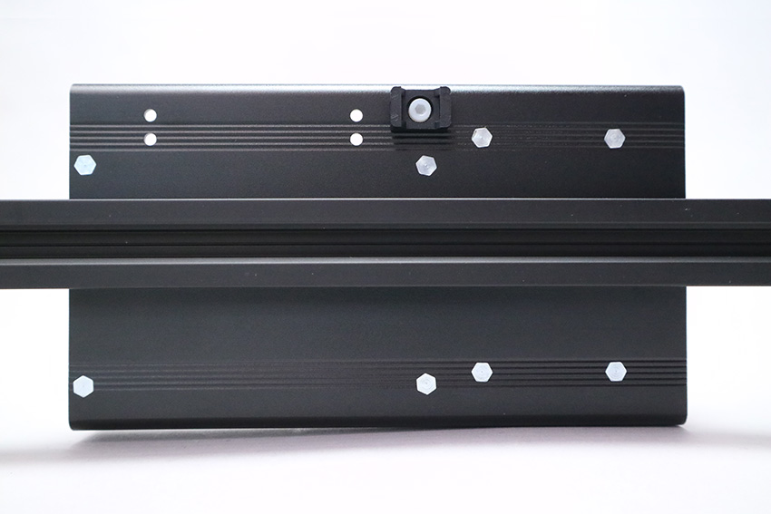

## Circuit Board Installation（3.5W）
Install the PCB case with two M5x6 low head bolts using the M5T nut pre-inserted for Y-axis assembly.

Install the laser circuit board to the PCB case using four M3x5 nylon screws.
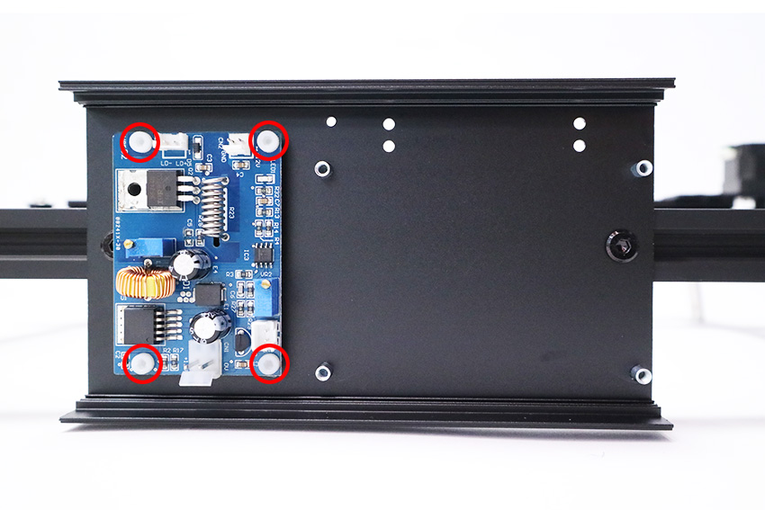

Install the control board to the PCB case using four M3x5 nylon screws.
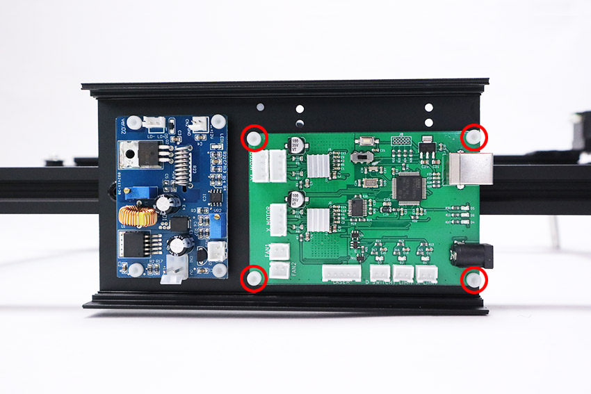

Ensure that the control board switch is on the left side.
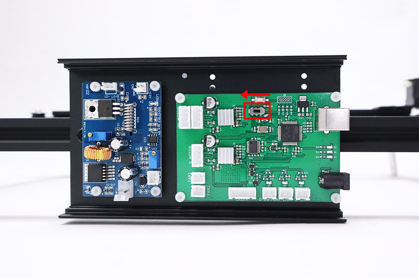

Fasten the cable tie clamp to the back of the PCB case using a M3x5 nylon screw.
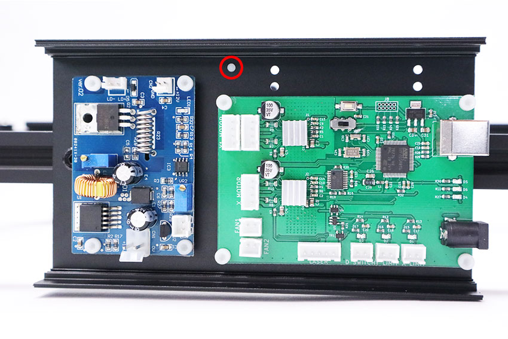

