## Parts List
<table class="packing-list">
<tbody>
<tr>
<td>No</td>
<td>Parts Name</td>
<td>Notes</td>
<td class="packing-img">Pictures</td>
<td>Qty</td>
</tr>
<tr>
<td>13</td>
<td>PCB Cable</td>
<td></td>
<td></td>
<td>1</td>
</tr>
<tr>
<td>14</td>
<td>Laser Cable</td>
<td></td>
<td>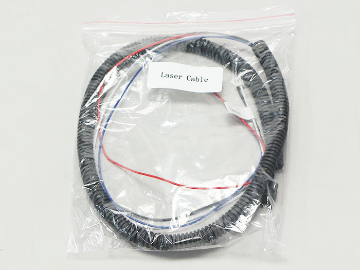</td>
<td>1</td>
</tr>
<tr>
<td>15</td>
<td>X-Axis Cable</td>
<td></td>
<td>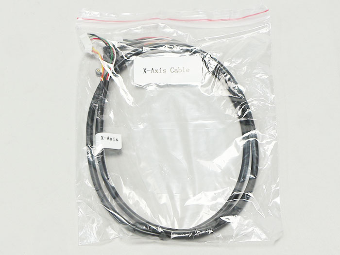</td>
<td>1</td>
</tr>
<tr>
<td>16</td>
<td>Y-Axis-R Cable</td>
<td></td>
<td></td>
<td>1</td>
</tr>
<tr>
<td>17</td>
<td>Y-Axis-L Cable</td>
<td></td>
<td>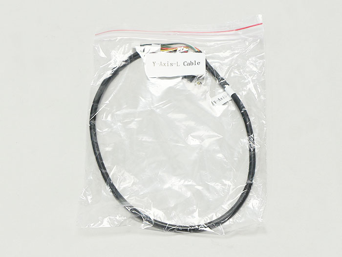</td>
<td>1</td>
</tr>
<tr>
<td>18</td>
<td>Foot Switch Cable</td>
<td></td>
<td></td>
<td>1</td>
</tr>
<tr>
<td>25</td>
<td>Cable tie</td>
<td></td>
<td>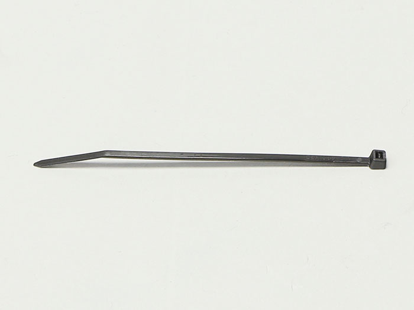</td>
<td>1</td>
</tr>
</tbody>
</table>

 
Procedure differs for 1.6 W model and 3.5 W model. See relevant sections as they are explained below.

## Wiring（1.6W）
Wire the following six cables according to the picture below.

### PCB Cable
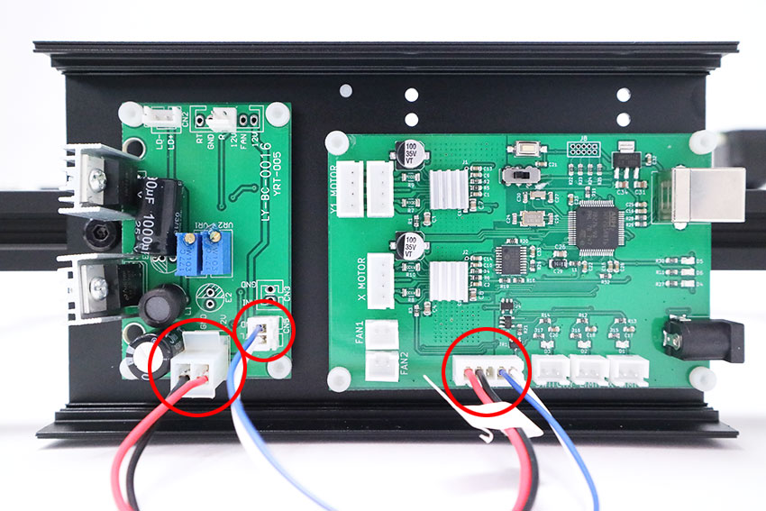

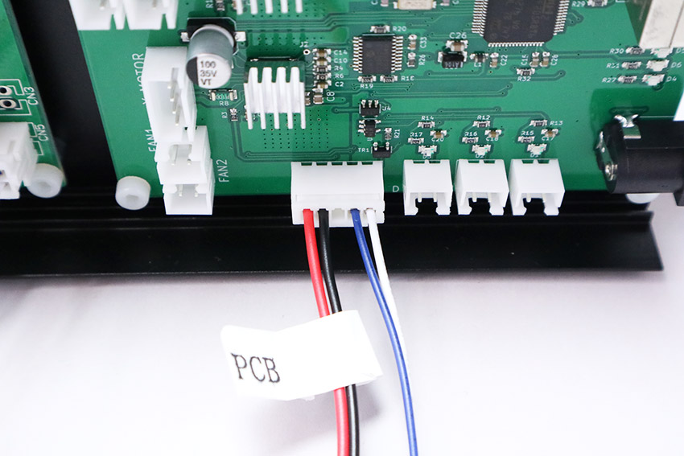

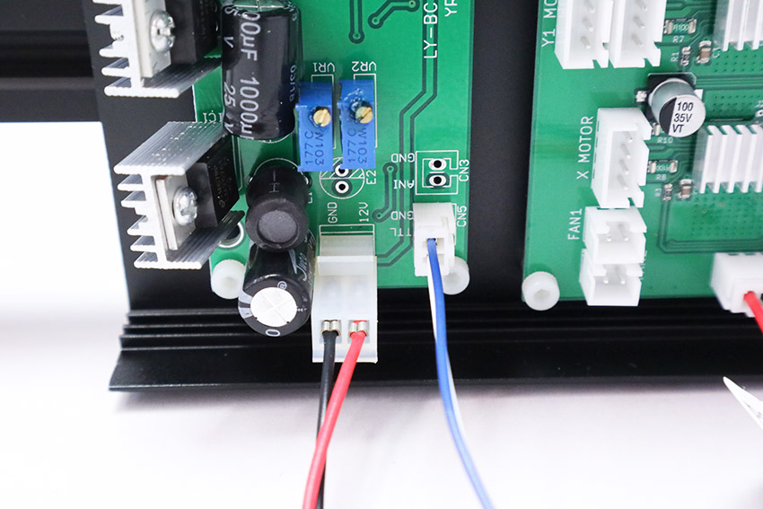

### Laser Cable
*Opposite end will be wired later.

### X-Axis Cable
*Opposite end will be wired later.
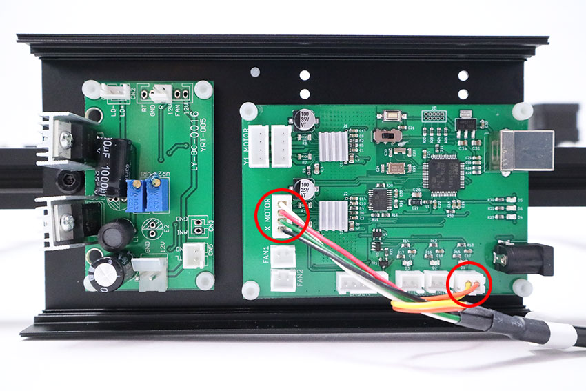

### Y-Axis-R Cable
*Opposite end will be wired later.
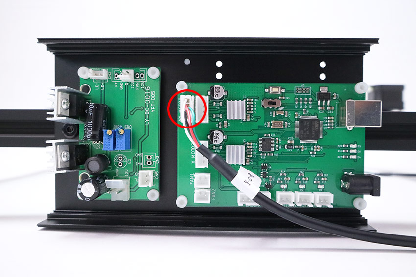

### Y-Axis-L Cable
*Opposite end will be wired later.
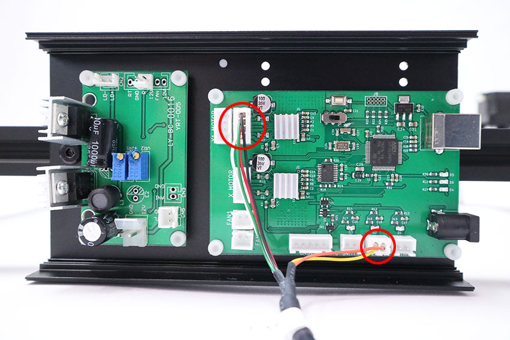

### Foot Switch Cable
*Opposite end will be wired later.
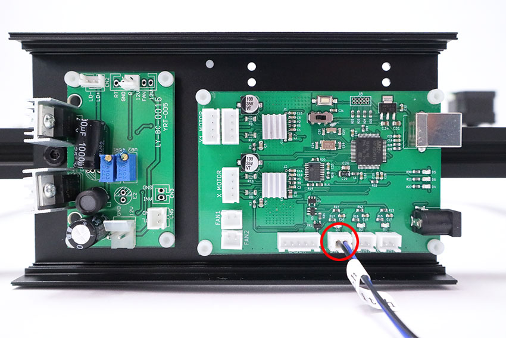

### Wiring Complete
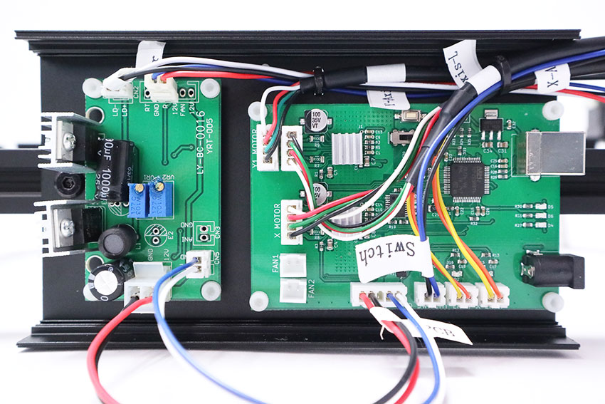

Gather the wires in the PCB case with two cable ties. See video below for how to fix them.   
[Video　1.6W Wiring Summary]

It should look like the picture below from behind after gathering wires with cable ties. Cut off excess material from cable ties.
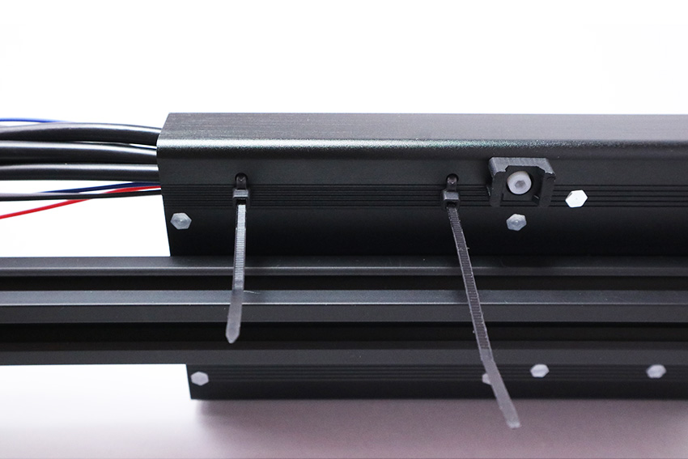

## Wiring（3.5W）
Wire the following six cables as shown in the picture below.

### PCB Cable
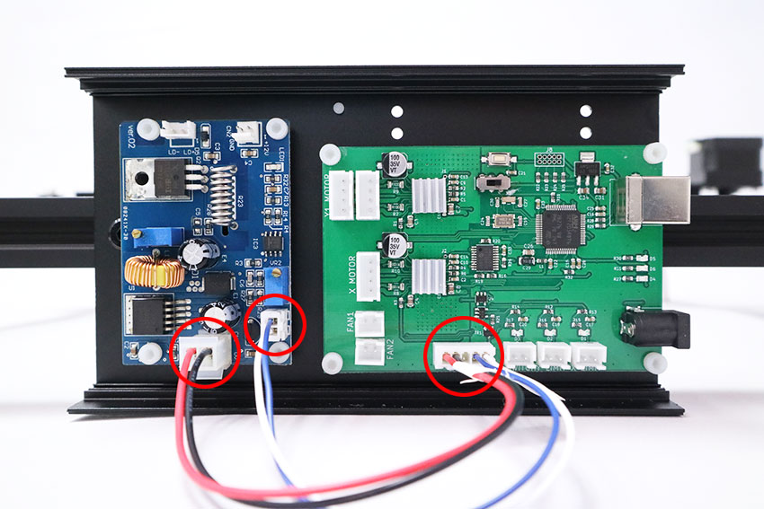

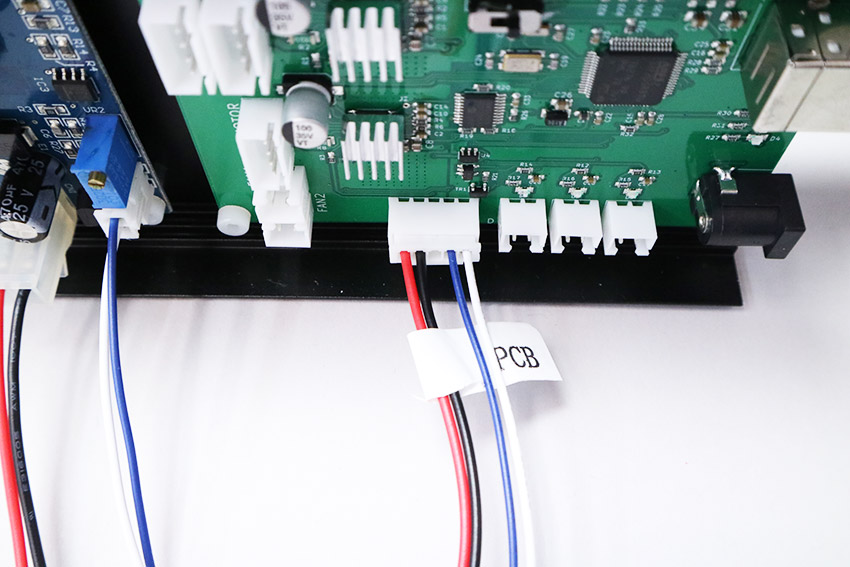

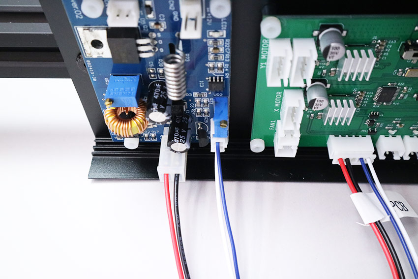

### Laser Cable
*Opposite end will be wired later.
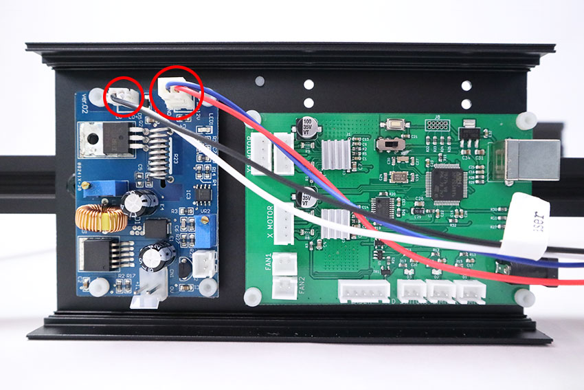

### X-Axis Cable
*Opposite end will be wired later.
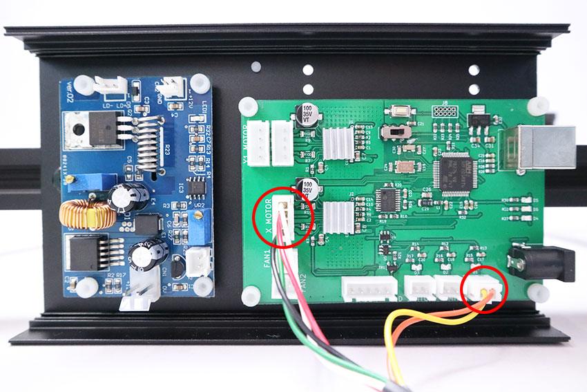

### Y-Axis-R Cable
*Opposite end will be wired later.
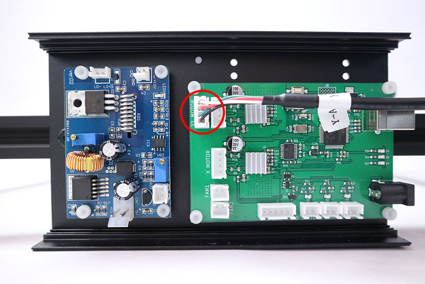

### Y-Axis-L Cable
*Opposite end will be wired later.
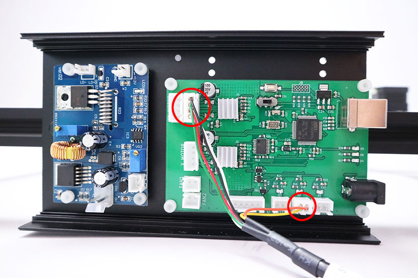

### Foot Switch Cable
*Opposite end will be wired later.
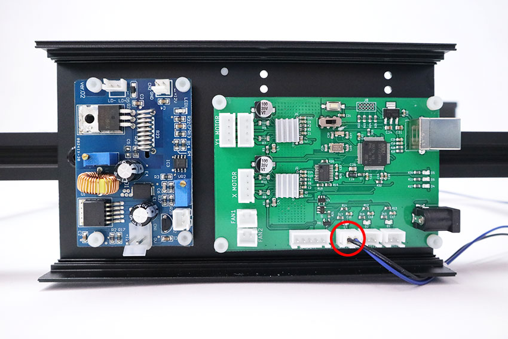

### Wiring Complete
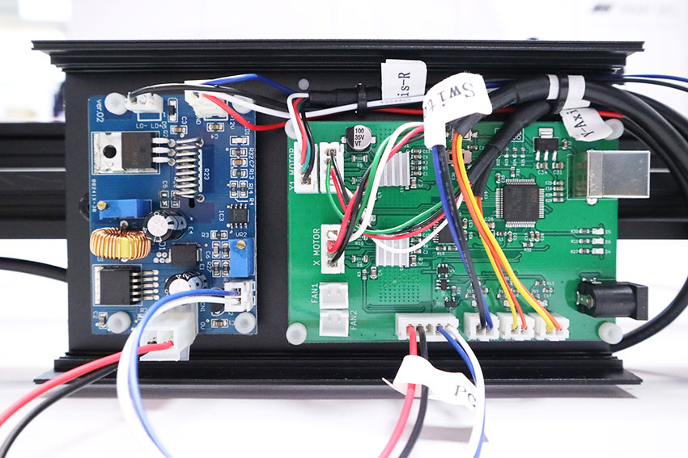

Gather the wires in the PCB case with two cable ties. See video below for how to fix them.  
[Video　3.5W Wiring Summary]

It should look like the picture below from behind after gathering wires with cable ties. Cut off excess material from cable ties.

