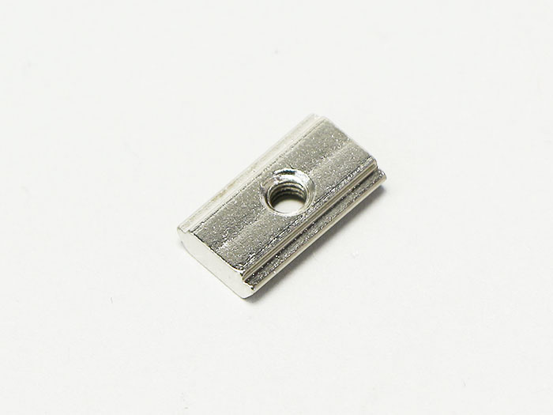
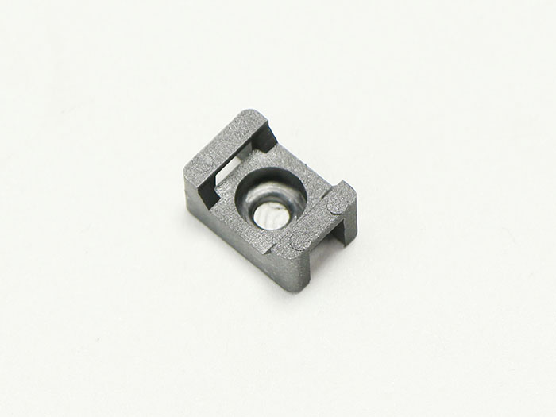

## Parts List
<table class="packing-list">
<tbody>
<tr>
<td>No</td>
<td>Parts Name</td>
<td>Notes</td>
<td class="packing-img">Pictures</td>
<td>Qty</td>
</tr>
<tr>
<td>41</td>
<td>M3 T Nut</td>
<td>Screw case</td>
<td></td>
<td>3</td>
</tr>
<tr>
<td>40</td>
<td>M3×6 Hexagon Socket Cap Screw</td>
<td>Screw case</td>
<td></td>
<td>6</td>
</tr>
<tr>
<td>24</td>
<td>Cable catch</td>
<td></td>
<td></td>
<td>1</td>
</tr>
<tr>
<td>25</td>
<td>Cable tie</td>
<td></td>
<td></td>
<td>1</td>
</tr>
<tr>
<td>35</td>
<td>M2x10 Hexagon Socket Cap Screw</td>
<td>ネジケース</td>
<td></td>
<td>8</td>
</tr>
</tbody>
</table>

## X-Axis Cable Wiring
Replace the body and attach the X-Axis cable limit switch to the X-axis motor unit with two M2x10 hex socket head cap bolts.  
*Take note of the correct mounting orientation for the limit switch.

Connect the X-Axis cable to the stepping motor.

Secure the X-Axis cable to the X-Axis motor unit at the following 2 places with cable ties.

## Y-Axis-L Cable Wiring
Attach the limit switch of the Y-Axis-L cable to the Y-axis motor unit with two M2x10 hex socket head cap bolt. After installation, connect the Y-Axis-L cable to the stepping motor.  
*Take note of the correct mounting orientation for the limit switch.

## Foot Switch Cable Wiring
Attach the Foot Switch cable limit switch to the Y-axis motor unit with two M2x10 hex socket head cap screws.

##Cable Wiring (4 types)
Connect the Y-Axis-R cable to the stepping motor in the upper right.

Stand the main body up and insert to M3 post-insertion nuts where indicated in red.

Attach cable tie clamp to the M3 post-insertion nut that was previously inserted with M3x6 hex socket boils.

Secure the Y-Axis-R cable to the cable tie securing part (right side) previously attached.

Secure the X-Axis cable, Y-Axis-L cable, and Foot Switch cable to the cable tie that you attached earlier (left side) with cable ties.   
*Wire so that the cable does not stick to the USB cable connection part (red circle).

## Securing Laser Cable
Secure the corrugated tube to the back of the PCB case with a cable tie.

Secure the other side of the corrugated tube to the M4x8 low-head bolt on the optical stage (mini v plate_C) with a cable tie.

Secure the Laser cable and the Y-Axis-R cable with two cable ties.

Lastly, cut off excess material from the cable ties.
