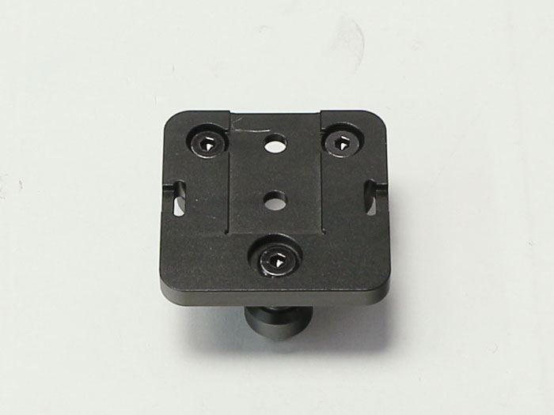
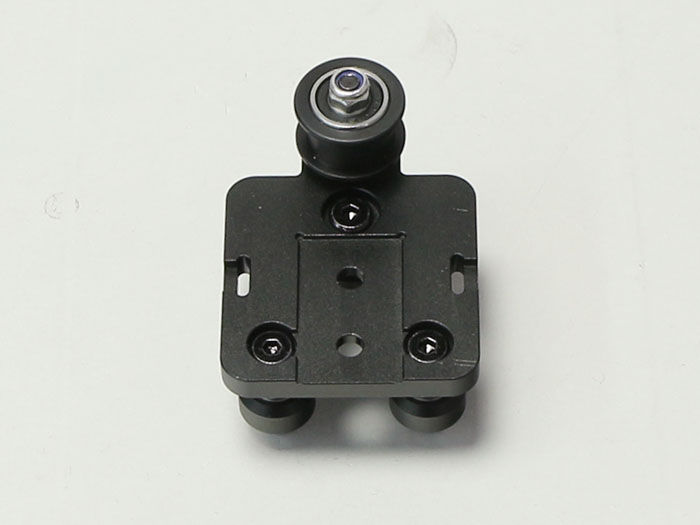
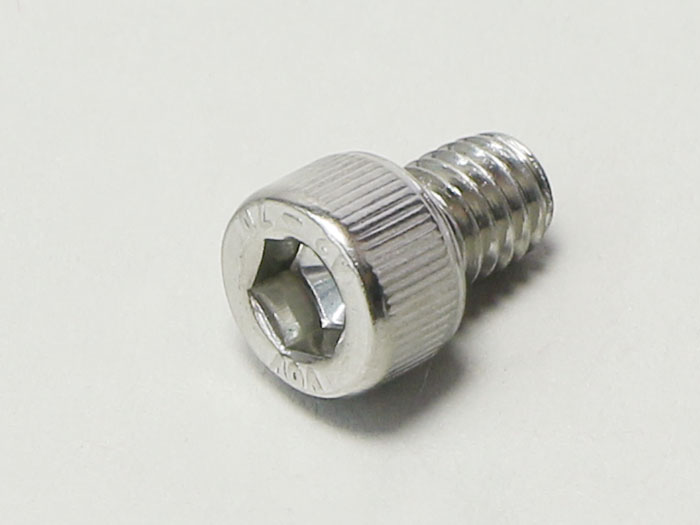
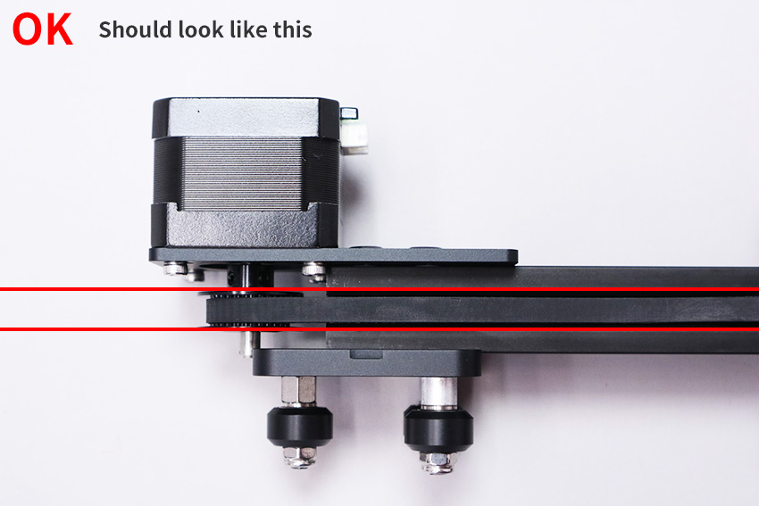
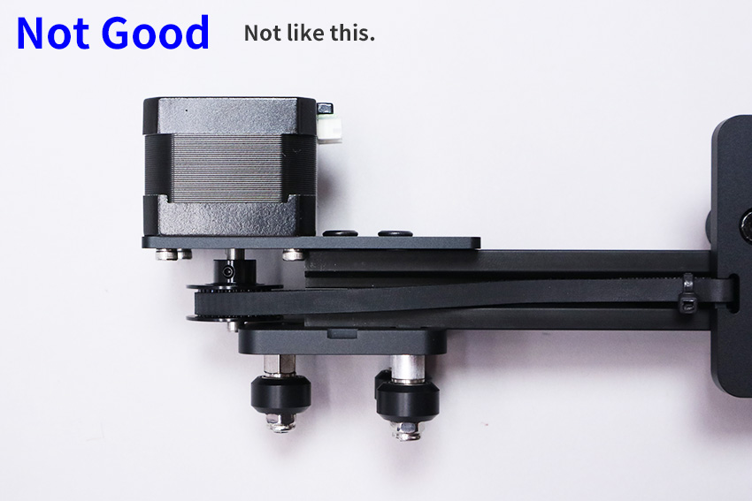

## Parts List
<table class="packing-list">
<tbody>
<tr>
<td>No</td>
<td>Parts Name</td>
<td>Notes</td>
<td class="packing-img">Pictures</td>
<td>Qty</td>
</tr>
<tr>
<td>10</td>
<td>mini v plate_C</td>
<td></td>
<td></td>
<td>1</td>
</tr>
<tr>
<td>11</td>
<td>mini v plate_L</td>
<td></td>
<td></td>
<td>1</td>
</tr>
<tr>
<td>12</td>
<td>mini v plate_R</td>
<td></td>
<td></td>
<td>1</td>
</tr>
<tr>
<td></td>
<td>X-axis motor unit</td>
<td></td>
<td></td>
<td>1</td>
</tr>
<tr>
<td>1</td>
<td>V-slot 450mm</td>
<td>300x230mmで使用</td>
<td></td>
<td>1</td>
</tr>
<tr>
<td>21</td>
<td>Optical Stage</td>
<td></td>
<td></td>
<td>1</td>
</tr>
<tr>
<td>42</td>
<td>M4×8 Low Head Screw</td>
<td>Screw case</td>
<td></td>
<td>10</td>
</tr>
<tr>
<td>46</td>
<td>M5 T Nut</td>
<td>Screw case</td>
<td></td>
<td>28</td>
</tr>
<tr>
<td>45</td>
<td>M5×8 Low Head Screw</td>
<td>Screw case</td>
<td></td>
<td>25</td>
</tr>
<tr>
<td>25</td>
<td>Cable tie</td>
<td></td>
<td></td>
<td>1</td>
</tr>
<tr>
<td>47</td>
<td>M6×8 hexagon socket Cap Screw</td>
<td>Screw case</td>
<td></td>
<td>5</td>
</tr>
<tr>
<td></td>
<td>Timing belt 106cm</td>
<td></td>
<td></td>
<td>1</td>
</tr>
</tbody>
</table>

## X-Axis Assembly
### Mini V Plate (3 types) Adjustment/Check
Check to ensure the 10 screws indicated in red below are fastened tightly.

Tighten any loose screws with the hexagon wrench.

### Eccentric Spacer Adjustment
Attach the eccentric spacers where indicated in red.

<iframe width="560" height="315" src="https://www.youtube.com/embed/B9VzXz4hIBU" frameborder="0" allow="accelerometer; autoplay; encrypted-media; gyroscope; picture-in-picture" allowfullscreen></iframe>

Adjust mini v plate_L, mini v plate_R, and mini v plate_C.

### Mini V Plate_R Installation
Slide mini v plate_C into V-slot 450mm.

Flip V-slot 450mm over and insert two M5T nuts as shown in picture.

Install mini v plate_R using two M5x8 low head bolts. Align the tip of V-slot 450mm to the groove of mini v plate_R.

### Mini V Plate_L Installation
Insert two M5T nuts where indicated in the picture.

Install mini v plate_L using two M5x8 low head bolts. Align the tip of V-slot 450mm to the groove of mini v plate_L.

## X-Axis Motor Unit Mount
Insert two M5T nuts into the V-slot 450mm where indicated in the picture.

Mount the X-Axis motor unit using two M5x8 hex socket head cap bolts.  
*Mount tentatively as it will be adjusted at a later stage.

## Timing Belt Mounting
Mount the timing belt so that the grooves of the uneven surface align with the timing pulley teeth.  
*Ensure timing belt is not twisted.  

Attach timing belt where indicated A-D as shown in picture.

A, Insert timing 106mm belt into mini v plate_C with the jagged side up and secure it with a cable tie. See video for how to secure.

[Timing Belt Fastening Video]

Insert timing belt into B and C.

D, Insert timing 106mm belt into right side of mini v plate_C with the jagged side up and secure it with a cable tie.

If there is extra material remaining of the timing belt, cut it off leaving about 30mm. Cut off excess from the cable ties. There may be risk of injury if there is any excess material remaining so cut as close to the base as possible.

Adjust the positioning of the X-Axis motor unit. Ensure that it is aligned with the groove of v-slot 450mm.

 It should look like this.
 

Not like this.

If it is significantly out of alignment, loosen the caterpillar screws, adjust, and refasten.

Tighten the timing belt. Loosen the X-Axis motor unit M5x8 bolts and refasten, pulling it in the direction of the arrow. Ensure that stepping motor and V-slot are aligned evenly. See video below for proper timing belt tension.

[Video Timing Belt Tension]

## Optic Stage Mounting
Mount optic stage to mini v plate_C using two M6x8 hex socket head cap bolts.

Insert M4x8 low head bolt to top of optic stage.

