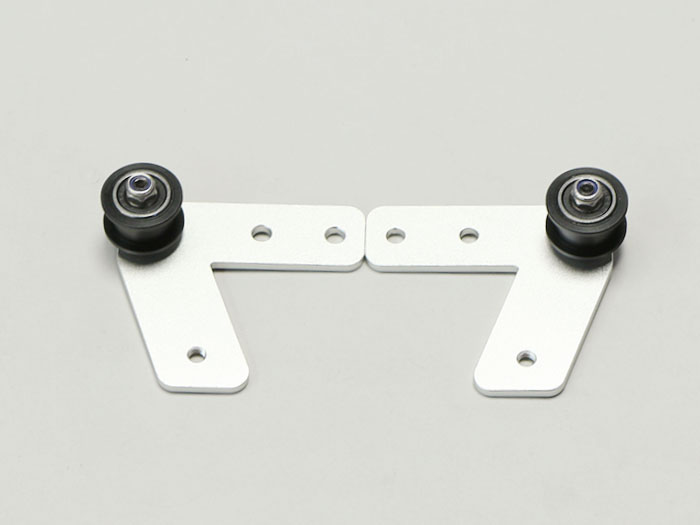
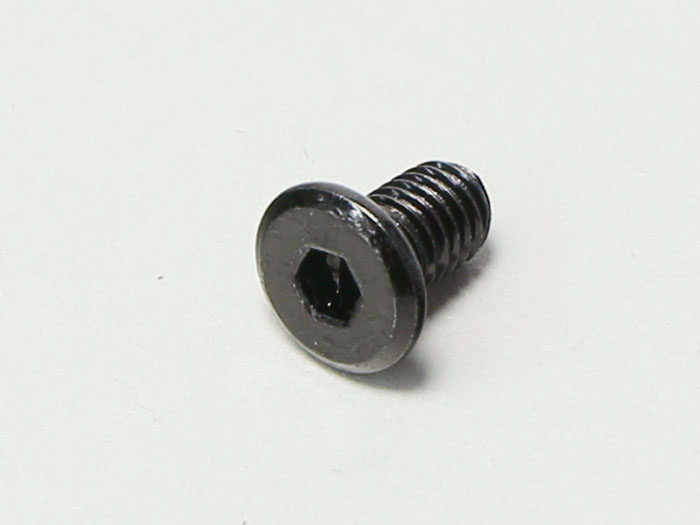
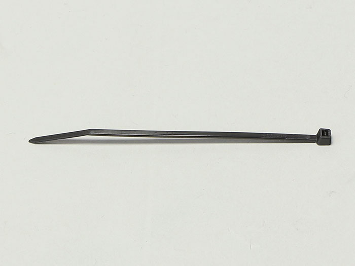

## Parts List
<table class="packing-list">
<tbody>
<tr>
<td>No</td>
<td>部品名</td>
<td>備考</td>
<td class="packing-img">画像</td>
<td>個数</td>
</tr>
<tr>
<td></td>
<td>X-axis unit</td>
<td></td>
<td></td>
<td>1</td>
</tr>
<tr>
<td>2</td>
<td>V-slot 410mm</td>
<td>300x230mmで使用</td>
<td></td>
<td>4</td>
</tr>
<tr>
<td></td>
<td>Y-axis motor</td>
<td></td>
<td></td>
<td>2</td>
</tr>
<tr>
<td>26</td>
<td>idler pulley plate</td>
<td></td>
<td></td>
<td>2</td>
</tr>
<tr>
<td></td>
<td>Timing belt 100cm</td>
<td></td>
<td></td>
<td>2</td>
</tr>
<tr>
<td>46</td>
<td>M5 T Nut</td>
<td>Screw case</td>
<td></td>
<td>28</td>
</tr>
<tr>
<td>6</td>
<td>Bracket</td>
<td>300x230mmで使用</td>
<td></td>
<td>4</td>
</tr>
<tr>
<td>45</td>
<td>M5×8 Low Head Screw</td>
<td>Screw case</td>
<td></td>
<td>25</td>
</tr>
<tr>
<td>42</td>
<td>M4×8 Low Head Screw</td>
<td>Screw case</td>
<td></td>
<td>10</td>
</tr>
<tr>
<td>25</td>
<td>Cable tie</td>
<td></td>
<td></td>
<td>1</td>
</tr>
</tbody>
</table>

## Frame Assembly
Assemble on flat, level surface.
First, insert two M5T nuts into V-slot 410mm.

Combine the previous V-slot 410mm, (for the vertical frame, turn the side with the M5T nuts inserted to the back), and the other two V-slots 410mm. Insert bracket where indicated in red.

Secure brackets with M4x8 low head bolts.  
*Do not tighten bolts all the way.

Slide the X-Axis unit from before into the assembled frame. Take note of the orientation of the X-Axis unit, the V-slot 410mm groove and the mini v wheel should align.

Install the final frame. Insert brackets where indicated in red and secure with M4x8 low head bolts.

### Frame Angle Check
Check that the frame meets at right angles. Use a right angle ruler to confirm. Given the characteristics of the aluminum frame, it may not form a perfect right angle unless there is a slight gap in the frame. There is no problem if there is such a gap. Prioritize making the corners perfectly square over closing the gap.

## Idler Pulley Plate and Y-Axis Motor Unit Installation
Install the idler pulley plate and Y-Axis motor unit.

First, insert two M5T nuts in the fore left and install the idler pulley plate using two M5x8 low head bolts. (Photo taken from left side.)  
*Final adjustments will be conducted later; refer to picture and temporarily fix the idler pulley so that it just makes contact with the v-slot 410mm.

Next, insert two M5T nuts in the left rear and attach the Y-axis motor unit with two M5x8 low head bolts.  
*When using the Y-axis motor unit, use the one with the small hole on the right side at the top when installed.

When installing, adjust the position so that the Y axis motor unit line and the end of the aluminum frame seen in the back are on a straight line. There is also a wire at the same position on the inside, so ensure that the wire is perfectly aligned with the tip of V-slot 410mm.

Ensure that the timing pulley is aligned with the groove of V-slot 410mm as shown in the following picture. (The picture is taken from the far side.) If it is off, loosen the two timing pulley caterpillar screws, adjust, and re-tighten them.

It should look like this.

Not like this.

Install the idler pulley plate and the Y-axis motor unit in the same way on the other side.

## Y-Axis Check, V-slot Adjustment
Manually check the operation of the Y axis. As shown in the following video, the X-axis unit falls down naturally when the main unit is upright.  
If you try to move the X-axis unit over the entire movable range and feel even a slight catch, turn the eccentric spacers on the left and right of the X-axis unit little by little and adjust to loosen.

[Video　Y-Axis Adjustment]  
  
[Video　Y-Axis Adjustment]  
  

## Timing Belt Installation
For those who purchased the 300x230 processing area unit, cut the timing belts to 1000mm.  
Install the timing belt using a cable tie as you did for the X-Axis. Insert the timing belt through mini v plate_R and secure it with a cable tie.

Insert into the front and back pulleys and secure to mini v plate_R with a cable tie. In order to adjust the tension of the belt later, allow some slack.

To tighten the timing belt, loosen the screw on the idler pulley plate side and retighten it while pulling as shown in the photo. Ensure that the timing belt is tight.

Install the timing belt on the other side in the same way, then pull the idler pulley plate and tighten the it.

If there is extra material remaining of the timing belt, cut it off leaving about 20-30mm.  
Finally, cut off excess material from the cable tie.
